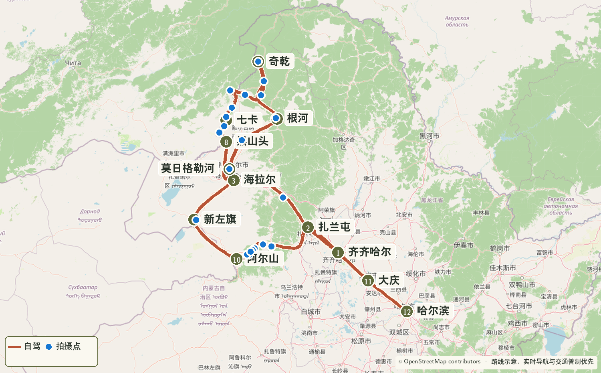
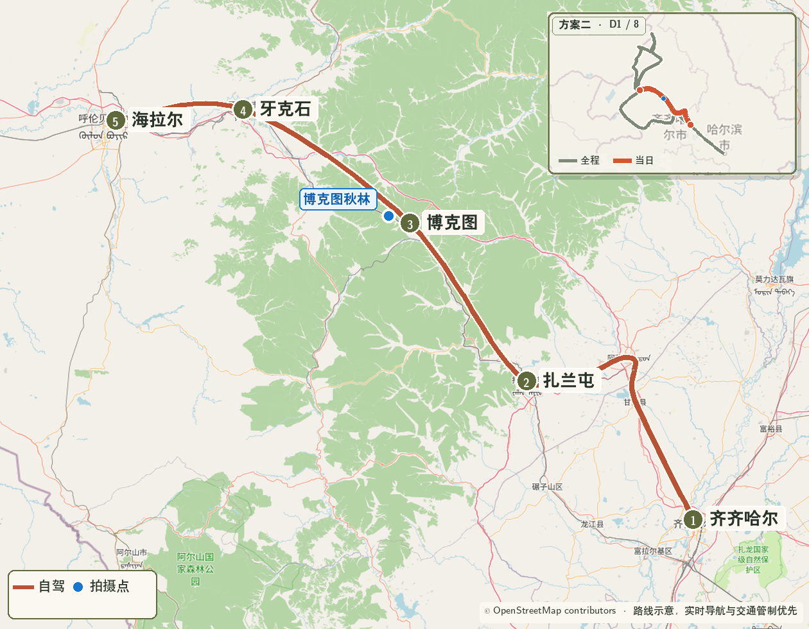
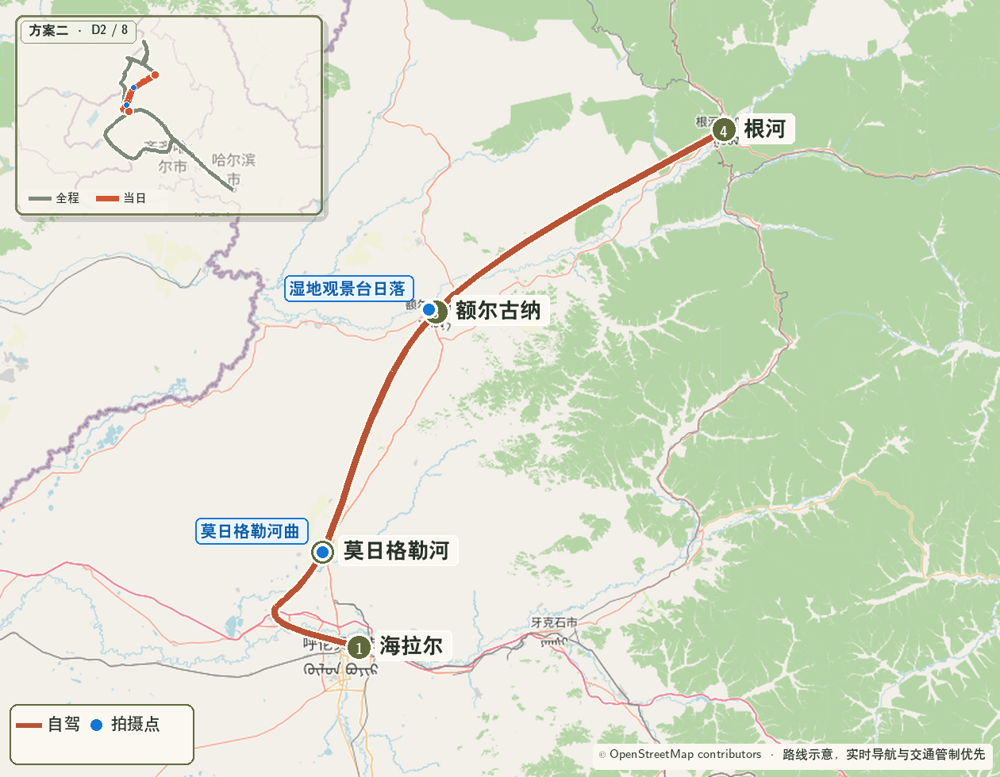
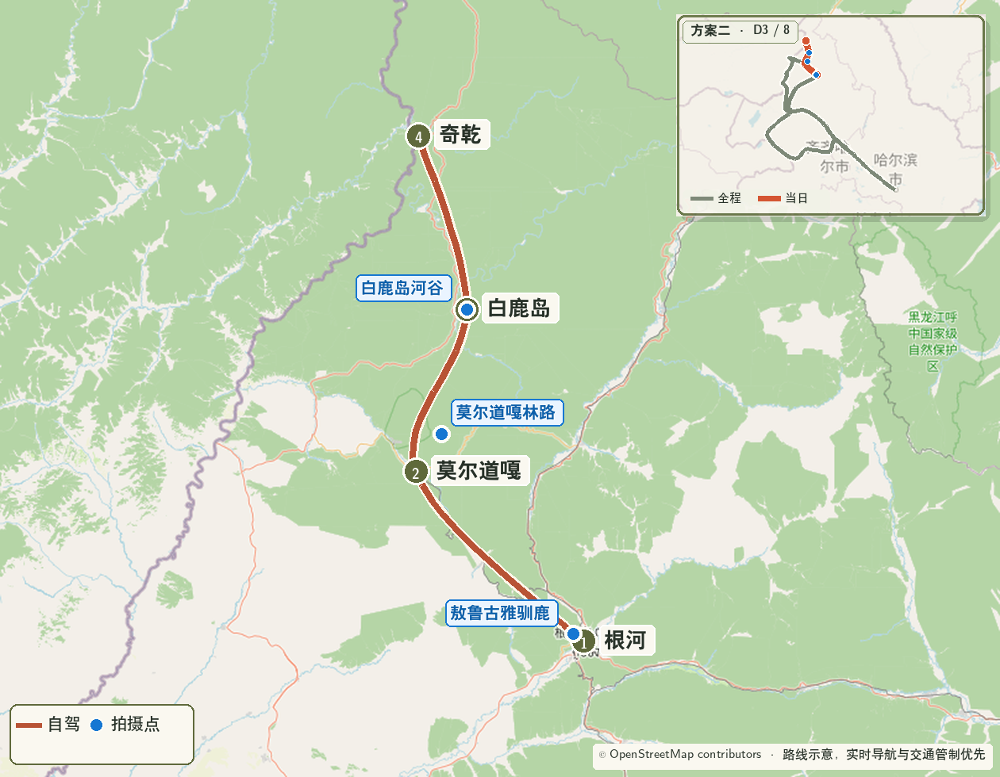
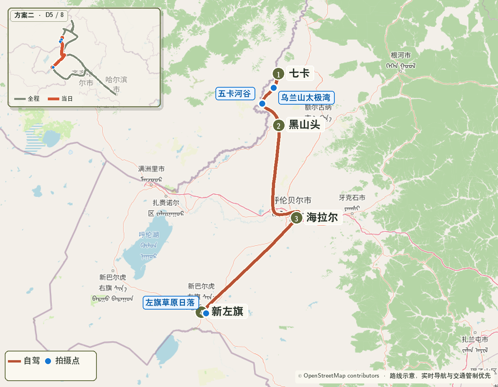
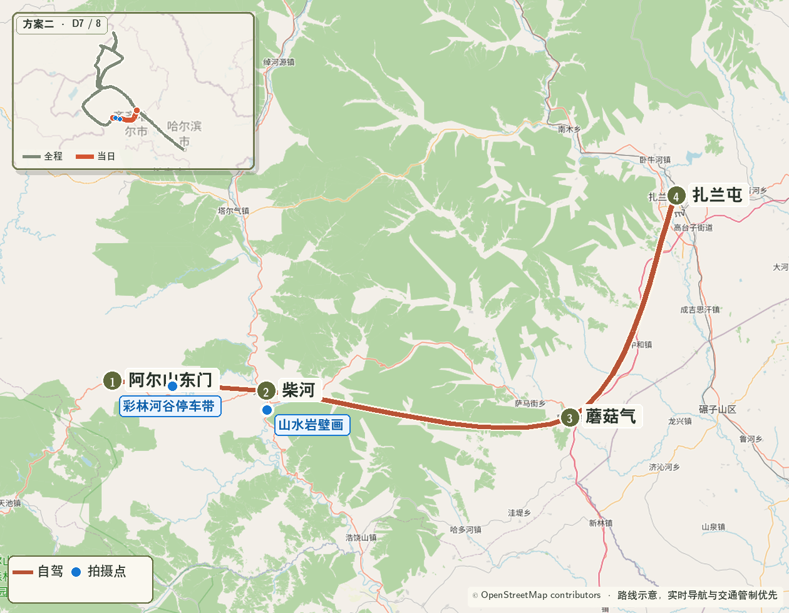
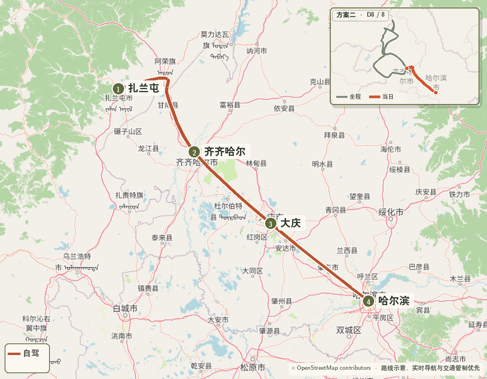

> 使用条件：9 月 23—24 日实时画面显示奇乾、根河已经进入盛色，而阿尔山仍明显偏绿。 
> 核心路线：齐齐哈尔 → 海拉尔 → 莫日格勒河 → 根河 → 奇乾 → 卡线 → 新巴尔虎左旗 → 阿尔山 → 蘑阿公路 → 扎兰屯 → 哈尔滨

{.route-map fig-alt="从齐齐哈尔先到海拉尔、根河和奇乾，再反向经过卡线、阿尔山和蘑阿公路到哈尔滨的路线图"}

> 地图图例：砖红色  表示自驾路线，橄榄色  编号表示路线节点，蓝色  圆点表示重点拍摄位置。

::: {.route-strip}
[09.26 齐齐哈尔 → 海拉尔](#reverse-day-1) [09.27 莫日格勒河 → 根河](#reverse-day-2) [09.28 莫尔道嘎 → 奇乾](#reverse-day-3) [09.29 奇乾 → 七卡](#reverse-day-4) [09.30 卡线 → 新左旗](#reverse-day-5) [10.01 新左旗 → 阿尔山](#reverse-day-6) [10.02 蘑阿公路 → 扎兰屯](#reverse-day-7) [10.03 齐齐哈尔 → 哈尔滨](#reverse-day-8)
:::

## 一、方案重点

- 先到奇乾和根河锁定更早成熟的北部秋色，再反向完成卡线和阿尔山；
- 奇乾住宿仍需提前确认，阿尔山住宿改为 10 月 1 日；
- 全程固定早起只保留 9 月 29 日奇乾晨雾；
- 9 月 26 日、9 月 29 日和 10 月 3 日转场较长，只有秋色差异明确时才值得启用。

## 二、逐日行程

### Day 1｜9 月 26 日：齐齐哈尔—扎兰屯—博克图—牙克石—海拉尔 {#reverse-day-1}

{.route-map fig-alt="方案二第一天齐齐哈尔经扎兰屯、博克图和牙克石到海拉尔路线图"}

**里程与驾驶**：约 580—630 公里，纯驾驶约 8—9 小时。住宿海拉尔。

| 时间 | 安排 |
|---|---|
| 06:30 | 齐齐哈尔直接出发 |
| 09:15—09:35 | 扎兰屯外围补给、休息 |
| 11:40—12:20 | 博克图午餐 |
| 12:20—15:10 | 博克图—牙克石林区公路，保留一次秋林短停 |
| 15:10—15:30 | 牙克石加油、驾驶员休息 |
| 16:40—17:40 | 目标抵达海拉尔并入住 |

**摄影**：博克图镇外秋林公路为当天唯一计划拍摄点；不追莫日格勒河日落，避免第一天转场继续加码。

### Day 2｜9 月 27 日：海拉尔—莫日格勒河—额尔古纳—根河 {#reverse-day-2}

{.route-map fig-alt="方案二第二天海拉尔经莫日格勒河和额尔古纳到根河路线图"}

**里程与驾驶**：约 340—380 公里，纯驾驶约 6—7 小时。住宿根河。

| 时间 | 安排 |
|---|---|
| 08:00 | 起床 |
| 08:40 | 海拉尔出发 |
| 09:40—12:00 | 莫日格勒河高位河曲与自驾线 |
| 12:45—13:25 | 额尔古纳午餐、加油 |
| 13:30—15:00 | 额尔古纳湿地 |
| 15:00—18:30 | 前往根河，中途休息一次 |
| 18:30 前后 | 入住、晚餐 |

**摄影**：莫日格勒河为当天核心；额尔古纳湿地只安排白天拍摄，不等待日落。

### Day 3｜9 月 28 日：根河—莫尔道嘎—白鹿岛—奇乾 {#reverse-day-3}

{.route-map fig-alt="方案二第三天根河经莫尔道嘎和白鹿岛到奇乾路线图"}

**里程与驾驶**：约 300—340 公里，纯驾驶约 7—8 小时。住宿奇乾，必须提前预订。

| 时间 | 安排 |
|---|---|
| 08:00 | 起床 |
| 08:40—09:50 | 敖鲁古雅驯鹿与林地 |
| 10:00 | 从根河方向北上 |
| 12:30—13:15 | 莫尔道嘎午餐、加满油 |
| 13:15—14:00 | 镇外林路短停 |
| 15:10—15:40 | 白鹿岛河谷或正规停车带二选一 |
| 15:40—19:30 | 前往奇乾，天黑后不增加拍摄停留 |
| 19:30—20:30 | 入住、晚餐、确认晨雾机位 |

**道路**：按临行施工公告选择 X954、X325 与 G331 衔接；向民宿确认进村登记、晚餐、供暖和通信。

### Day 4｜9 月 29 日：奇乾—莫尔道嘎—太平—临江—室韦—七卡 {#reverse-day-4}

{.route-map fig-alt="方案二第四天奇乾经莫尔道嘎、太平、临江和室韦到七卡路线图"}

**里程与驾驶**：约 360—410 公里，纯驾驶约 8—9 小时。住宿七卡。

| 时间 | 安排 |
|---|---|
| 05:15—06:40 | 奇乾晨雾、木屋和河谷 |
| 06:45—08:00 | 早餐、短休、退房 |
| 08:10 | 离开奇乾 |
| 10:30—10:50 | 白鹿岛方向短休 |
| 12:00—12:40 | 莫尔道嘎午餐 |
| 13:30—14:40 | 太平、临江各一次短停 |
| 15:10—15:35 | 室韦补油、补水 |
| 16:00—18:20 | 九卡、八卡按光线各选一次短停 |
| 18:30—19:30 | 抵达七卡并入住 |

**摄影**：奇乾晨雾为绝对优先；下午只保留太平林路、临江河谷和七八卡 S 弯，不追固定日落。

### Day 5｜9 月 30 日：七卡—乌兰山—黑山头—海拉尔—新巴尔虎左旗 {#reverse-day-5}

{.route-map fig-alt="方案二第五天七卡沿卡线经黑山头和海拉尔到新巴尔虎左旗路线图"}

**里程与驾驶**：约 430—500 公里，纯驾驶约 7—8 小时。住宿新巴尔虎左旗。

| 时间 | 安排 |
|---|---|
| 08:00 | 起床 |
| 09:00 | 七卡出发 |
| 09:40—10:40 | 乌兰山太极湾 |
| 11:20—11:40 | 五卡河谷短停 |
| 12:20—13:00 | 黑山头午餐、加油 |
| 13:00—16:10 | 经陈巴尔虎旗前往海拉尔，途中休息 |
| 16:10—16:35 | 海拉尔补给 |
| 18:40—19:30 | 抵达新巴尔虎左旗；光线合适时拍镇外暮色 |

**摄影**：卡线南段仍是当天重点；16:00 后不增加支路，把剩余体力留给连续转场。

### Day 6｜10 月 1 日：新巴尔虎左旗—阿尔山 {#reverse-day-6}

{.route-map fig-alt="方案二第六天新巴尔虎左旗到阿尔山园区路线图"}

**里程与驾驶**：约 260—300 公里，纯驾驶约 4—5 小时。住宿阿尔山园区。

| 时间 | 安排 |
|---|---|
| 08:00 | 起床 |
| 08:45 | 新巴尔虎左旗出发 |
| 11:30—12:15 | 阿尔山市午餐、加满油 |
| 13:00—16:20 | 入园后在驼峰岭、杜鹃湖、石塘林中选择 1—2 个 |
| 16:20—16:50 | 入住或换乘接驳 |
| 17:00—18:05 | 不冻河日落与蓝调 |

**摄影**：不设置乌苏浪子湖日出；下午优先选择道路衔接顺畅的园区机位，再固定完成不冻河日落。

### Day 7｜10 月 2 日：阿尔山—蘑阿公路—柴河—扎兰屯 {#reverse-day-7}

{.route-map fig-alt="方案二第七天阿尔山经蘑阿公路、柴河和蘑菇气到扎兰屯路线图"}

**里程与驾驶**：约 300—340 公里，纯驾驶约 6—7 小时。住宿扎兰屯。

| 时间 | 安排 |
|---|---|
| 08:00 | 起床、早餐、退房 |
| 09:00 | 离开园区，进入蘑阿公路 |
| 09:30—13:00 | 蘑阿西段秋林、河谷和火山地貌，三次短停 |
| 13:00—13:40 | 柴河午餐 |
| 13:40—16:30 | 山水岩壁画、沿途正规停车带按光线择一 |
| 17:30—18:30 | 抵达扎兰屯并入住 |

**摄影**：28–70mm 拍层叠山林与道路消失点，16–28mm 拍近景河谷；把拍摄集中在白天，不等待重复日落。

### Day 8｜10 月 3 日：扎兰屯—齐齐哈尔—大庆—哈尔滨 {#reverse-day-8}

{.route-map fig-alt="方案二第八天扎兰屯经齐齐哈尔和大庆到哈尔滨路线图"}

**里程与驾驶**：约 600—680 公里，纯驾驶约 8—9 小时；当天为返程转场，不安排景点。

| 时间 | 安排 |
|---|---|
| 08:00 | 起床、早餐、退房 |
| 08:40 | 扎兰屯出发 |
| 11:50—12:35 | 齐齐哈尔外围午餐、加满油 |
| 15:20—15:45 | 大庆外围服务区休息 |
| 18:30—20:00 | 抵达哈尔滨，完成异地还车与住宿衔接 |

**执行重点**：全日每约 2 小时休息一次；不进入齐齐哈尔和大庆城区游览，为国庆车流及还车预留时间。

## 三、住宿与器材

- 奇乾 9 月 28 日、阿尔山园区 10 月 1 日的住宿必须提前锁定；
- 七卡和新巴尔虎左旗优先选择可取消、有停车位的房型；
- 28–70mm F2.8 为主力镜头，16–28mm F2.8 用于河谷、天池和带前景的大景；
- DJI Air 3S 在卡线、奇乾和边境区域只按现场明确许可执行。
