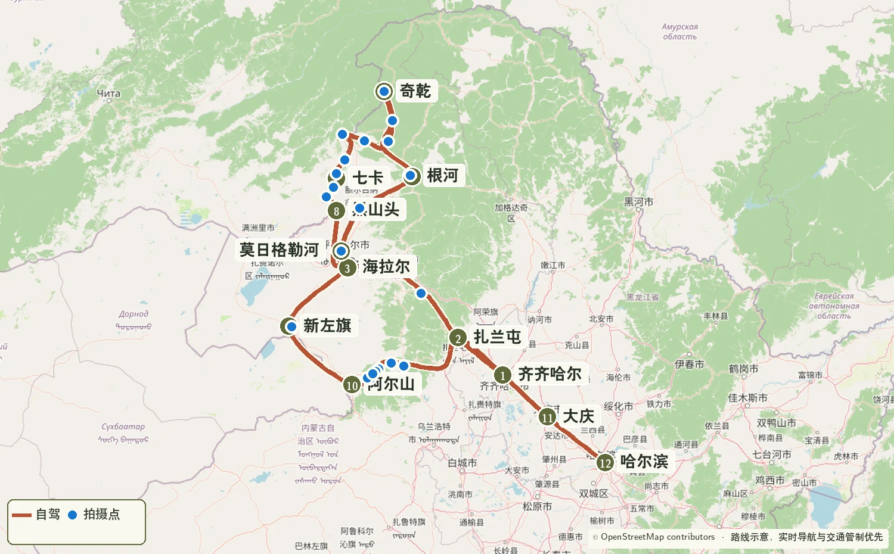
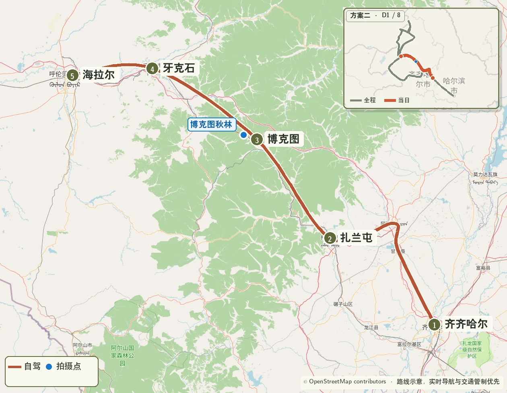
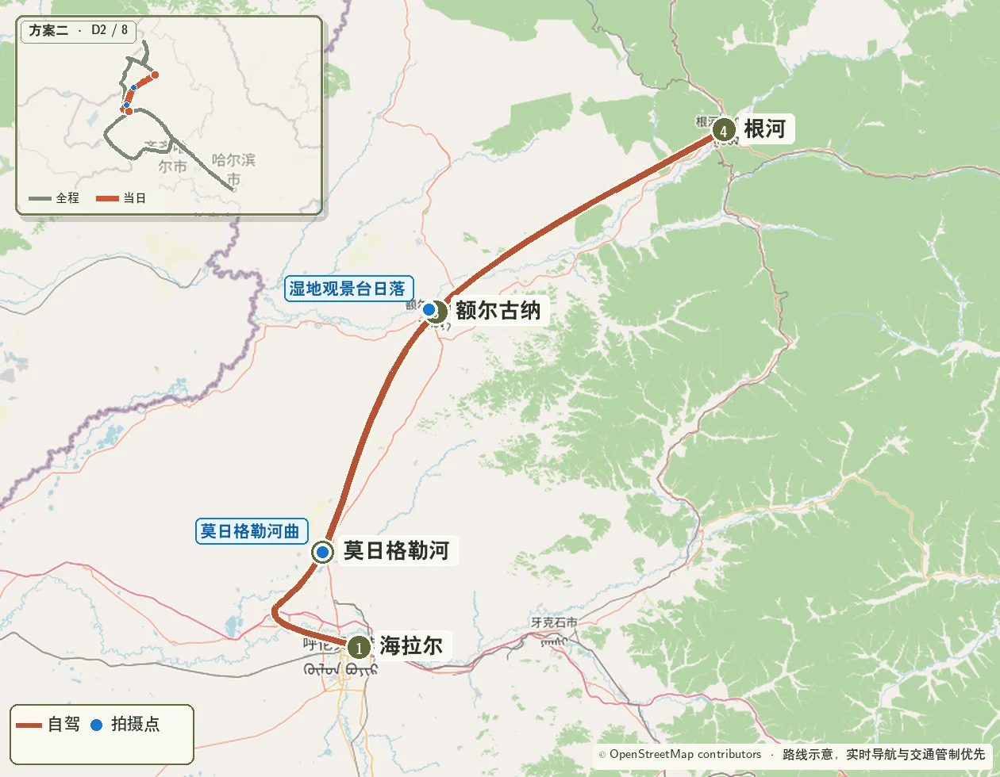
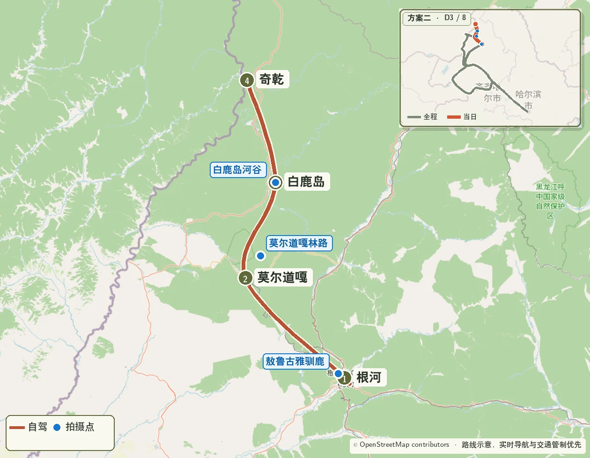
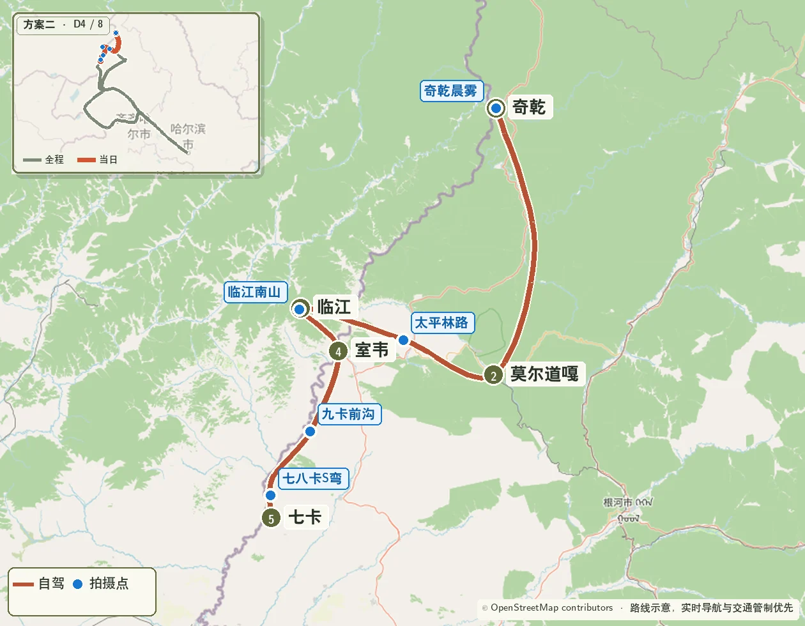
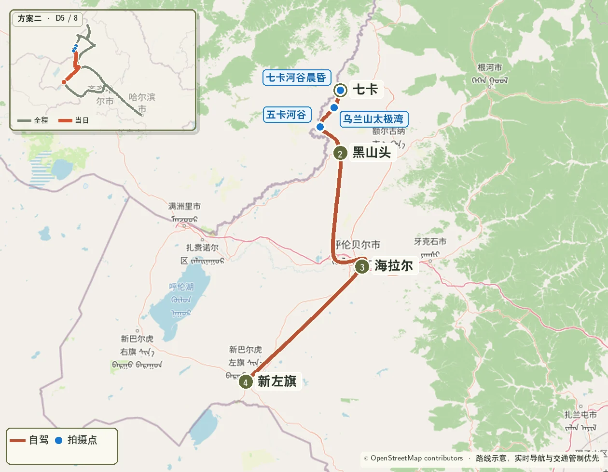
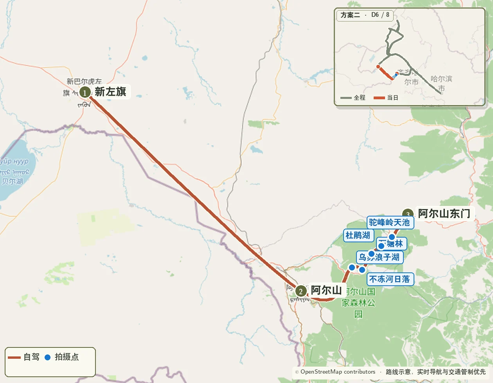
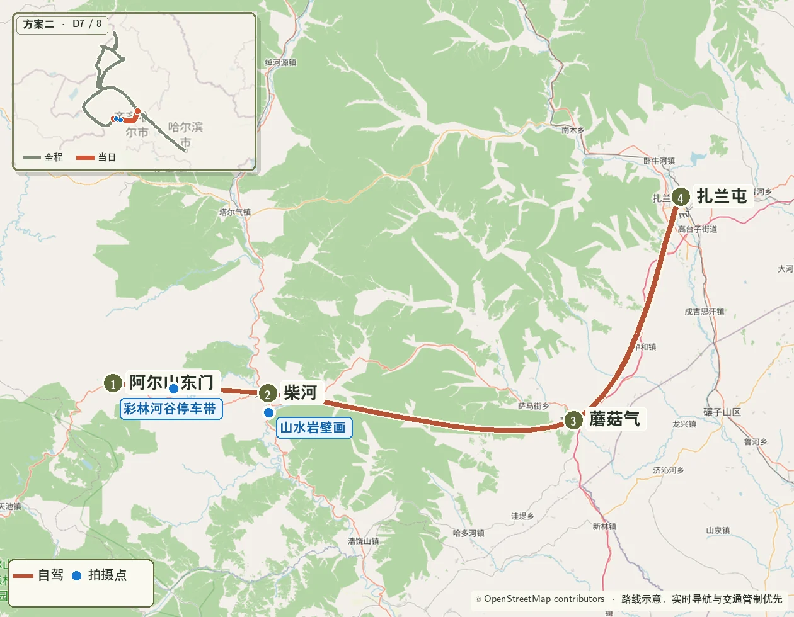

> 使用条件：9 月 23—24 日实时画面同时显示奇乾、根河已经进入盛色，阿尔山仍明显偏绿，且北部未来三天没有大风落叶风险。 
> 核心路线：齐齐哈尔 → 海拉尔 → 莫日格勒河 → 根河 → 奇乾 → 卡线 → 新巴尔虎左旗 → 阿尔山 → 蘑阿公路 → 扎兰屯 → 哈尔滨

{.route-map loading="eager" decoding="async" fetchpriority="high" fig-alt="从齐齐哈尔先到海拉尔、根河和奇乾，再反向经过卡线、阿尔山和蘑阿公路到哈尔滨的路线图"}

> 地图图例：砖红色  表示自驾路线，橄榄色  编号表示路线节点，蓝色  圆点表示重点拍摄位置。

::: {.route-strip}
[09.26 齐齐哈尔 → 海拉尔](#reverse-day-1) [09.27 海拉尔 → 根河](#reverse-day-2) [09.28 根河 → 奇乾](#reverse-day-3) [09.29 奇乾 → 七卡](#reverse-day-4) [09.30 七卡 → 新左旗](#reverse-day-5) [10.01 新左旗 → 阿尔山](#reverse-day-6) [10.02 阿尔山 → 扎兰屯](#reverse-day-7) [10.03 扎兰屯 → 哈尔滨](#reverse-day-8)
:::

## 一、摘要

- 先到奇乾和根河锁定更早成熟的北部秋色，再反向完成卡线和阿尔山；
- 奇乾住宿仍需提前确认，阿尔山住宿改为 10 月 1 日；
- 全程安排一次固定早起：9 月 29 日奇乾晨雾；
- 9 月 26 日、9 月 29 日和 10 月 3 日转场较长；三项启用条件同时成立时执行。

## 二、拍摄优先级

### S 级：整段行程的核心

- 莫日格勒河高位河曲；
- 奇乾村晨雾、木屋、河谷与秋林；
- 奇乾—莫尔道嘎—太平—临江—室韦—七卡的北部森林边境线；
- 七卡—乌兰山—五卡—黑山头的卡线核心段；
- 阿尔山驼峰岭天池、不冻河日落与蘑阿公路西段。

### A 级：天气合适时重点完成

- 博克图至牙克石秋林公路；
- 额尔古纳湿地白天景观；
- 敖鲁古雅驯鹿与林地；
- 白鹿岛河谷、太平林路与临江河谷；
- 不冻河日落。

### B 级：顺路拍摄

- 根河、莫尔道嘎镇外重复度较高的秋林；
- 七卡至黑山头沿途重复草原与河谷机位；
- 10 月 3 日齐齐哈尔、大庆外围转场记录。

### 地图蓝点清单

| 日期 | 蓝点拍摄地 | 执行方式 |
|---|---|---|
| 9 月 26 日 | 博克图镇外秋林公路 | 全日只保留一次正规停车带短停，抵达海拉尔优先 |
| 9 月 27 日 | 莫日格勒河高位河曲；额尔古纳湿地 | 河曲为当日核心；湿地只拍白天，不等待日落 |
| 9 月 28 日 | 敖鲁古雅驯鹿；莫尔道嘎林路；白鹿岛河谷 | 驯鹿固定；后两处按光线二选一，晚间抵达奇乾 |
| 9 月 29 日 | 奇乾晨雾；太平林路；临江南山；七八卡 S 弯 | 晨雾绝对优先；白鹿岛只经过短休；临江—太平直连道路可用时才进入临江；北段按时间删减 |
| 9 月 30 日 | 七卡河谷日出（天气备选）；乌兰山太极湾；五卡河谷 | 奇乾晨拍未获得有效画面、七卡次晨雾或层云明显更好且驾驶员休息充分时启用日出备选；其余时间按常规 08:00 起床。卡线南段为当天摄影重点，16:00 后连续转场 |
| 10 月 1 日 | 驼峰岭天池；不冻河日落 | 园区只完成一个代表性湖景，不冻河为固定日落机位 |
| 10 月 2 日 | 蘑阿西段彩林河谷；山水岩壁画 | 彩林河谷优先，三次短停后按时抵达扎兰屯 |
| 10 月 3 日 | 沿途服务区与道路记录 | 仅作转场记录，不增加支路和固定摄影点 |

## 三、日出与日落参考

以下时间用于安排到位节奏。前一晚按小时级云量、雾、降水和风重新确认；日出机位提前约 35—45 分钟、日落机位提前约 45—60 分钟到达。

| 日期 | 拍摄地 | 日出 | 日落 | 建议到位时间 |
|---|---|---:|---:|---:|
| 9 月 26 日 | 海拉尔 | 05:52 | 17:52 | 仅在 17:00 前入住时机动拍摄 |
| 9 月 27 日 | 额尔古纳 | 05:52 | 17:48 | 15:00 前离开，不等待日落 |
| 9 月 29 日 | 奇乾 | 05:53 | 17:41 | 05:10—05:15 |
| 9 月 30 日 | 七卡（天气备选） | 05:59 | 17:44 | 05:15—05:20；满足替换条件时执行 |
| 9 月 30 日 | 新巴尔虎左旗 | 06:04 | 17:50 | 预计日落后抵达，不设日落机位 |
| 10 月 1 日 | 阿尔山不冻河 | 05:56 | 17:40 | 16:45—16:55 |

## 四、逐日行程

### Day 1｜9 月 26 日：齐齐哈尔—扎兰屯—博克图—牙克石—海拉尔 {#reverse-day-1}

{.route-map loading="lazy" decoding="async" fig-alt="方案二第一天齐齐哈尔经扎兰屯、博克图和牙克石到海拉尔路线图"}

**里程与驾驶**：约 580—630 公里，纯驾驶约 8—9 小时。住宿海拉尔。

| 时间 | 安排 |
|---|---|
| 06:30 | 齐齐哈尔直接出发 |
| 09:15—09:35 | 扎兰屯外围补给、休息 |
| 11:40—12:20 | 博克图午餐 |
| 12:20—15:10 | 博克图—牙克石林区公路，保留一次秋林短停 |
| 15:10—15:30 | 牙克石加油、驾驶员休息 |
| 16:40—17:40 | 目标抵达海拉尔并入住 |

**摄影**：博克图镇外秋林公路为当天唯一计划拍摄点，日落前以抵达海拉尔和完整休息为先。

### Day 2｜9 月 27 日：海拉尔—莫日格勒河—额尔古纳—根河 {#reverse-day-2}

{.route-map loading="lazy" decoding="async" fig-alt="方案二第二天海拉尔经莫日格勒河和额尔古纳到根河路线图"}

**里程与驾驶**：约 340—380 公里，纯驾驶约 6—7 小时。住宿根河。

| 时间 | 安排 |
|---|---|
| 08:00 | 起床 |
| 08:40 | 海拉尔出发 |
| 09:40—12:00 | 按当天规则使用景交车或官方代驾完成莫日格勒河观景线 |
| 12:15 | 完成取车并离开；超过此时取消额尔古纳湿地停留，直接前往根河 |
| 12:45—13:25 | 额尔古纳午餐、加油 |
| 13:30—15:00 | 额尔古纳湿地 |
| 15:00—18:30 | 前往根河，中途休息一次 |
| 18:30 前后 | 入住、晚餐 |

**摄影**：莫日格勒河为当天核心；额尔古纳湿地只安排白天拍摄，不等待日落。

**交通**：提前两天确认社会车辆准入、景交车、官方代驾和南北游客中心取车方式。社会车辆不能连续穿越且无法在北端取车时，只完成可达的高位河曲并返回原停车点；12:15 前完成取车可继续进入额尔古纳湿地，超过 12:15 直接前往根河。

### Day 3｜9 月 28 日：根河—莫尔道嘎—白鹿岛—奇乾 {#reverse-day-3}

{.route-map loading="lazy" decoding="async" fig-alt="方案二第三天根河经莫尔道嘎和白鹿岛到奇乾路线图"}

**里程与驾驶**：约 300—340 公里，纯驾驶约 7—8 小时。住宿奇乾，必须提前预订。

| 时间 | 安排 |
|---|---|
| 08:00 | 起床 |
| 08:40—09:50 | 敖鲁古雅驯鹿与林地 |
| 10:00 | 从根河方向北上 |
| 12:30—13:15 | 莫尔道嘎午餐、加满油 |
| 13:15—14:00 | 镇外林路短停 |
| 15:10—15:40 | 白鹿岛河谷或正规停车带二选一 |
| 15:40—19:30 | 前往奇乾；天黑后连续行驶，按约 2 小时一次的节奏休息 |
| 19:30—20:30 | 入住、晚餐、确认晨雾机位 |

**道路**：按临行施工公告选择 X954、X325 与 G331 衔接；向民宿确认进村登记、晚餐、供暖和通信。

### Day 4｜9 月 29 日：奇乾—莫尔道嘎—太平—临江—室韦—七卡 {#reverse-day-4}

{.route-map loading="lazy" decoding="async" fig-alt="方案二第四天奇乾经莫尔道嘎、太平、临江和室韦到七卡路线图"}

**里程与驾驶**：约 360—410 公里，纯驾驶约 8—9 小时。住宿七卡。

| 时间 | 安排 |
|---|---|
| 05:15—06:40 | 奇乾日出、晨雾、木屋和河谷 |
| 06:45—08:00 | 早餐、短休、退房 |
| 08:10 | 离开奇乾 |
| 10:30—10:45 | 白鹿岛方向短休，不重复拍摄 |
| 12:00—12:35 | 莫尔道嘎午餐并确认太平—临江直连道路 |
| 13:25—14:10 | 道路开放且干燥时，太平、临江各一次短停；否则直接前往室韦 |
| 14:40—15:05 | 室韦补油、补水；15:05 为硬离场时间 |
| 15:30—17:00 | 九卡、八卡按光线择一短停 |
| 17:30—18:30 | 抵达七卡并入住 |

**摄影**：奇乾晨雾为绝对优先；下午依次安排太平林路、临江河谷和七八卡 S 弯，18:30 前后入住优先。

**道路**：太平—临江直连道路不可用时，跳过太平、临江并按实时导航前往室韦，不进入支线后再折返。15:05 未离开室韦时取消八卡、九卡摄影停留，直接前往七卡。

### Day 5｜9 月 30 日：七卡—乌兰山—黑山头—海拉尔—新巴尔虎左旗 {#reverse-day-5}

{.route-map loading="lazy" decoding="async" fig-alt="方案二第五天七卡沿卡线经黑山头和海拉尔到新巴尔虎左旗路线图"}

**里程与驾驶**：约 430—500 公里，纯驾驶约 7—8 小时。住宿新巴尔虎左旗。

| 时间 | 安排 |
|---|---|
| 05:15—06:45（天气备选） | 奇乾晨拍未获得有效画面、七卡次晨雾或层云明显更好且驾驶员休息充分时拍摄七卡河谷日出；条件不成立时继续休息 |
| 06:50—08:00（执行备选时） | 返回住宿补觉、早餐 |
| 08:00 | 常规起床；执行晨拍时结束补觉、整理行李 |
| 09:00 | 七卡出发 |
| 09:40—10:40 | 乌兰山太极湾 |
| 11:20—11:40 | 五卡河谷短停 |
| 12:20—13:00 | 黑山头午餐、加油 |
| 13:00—16:10 | 经陈巴尔虎旗前往海拉尔，途中休息 |
| 16:10—16:35 | 海拉尔补给 |
| 18:40—19:30 | 抵达新巴尔虎左旗并入住 |

**摄影**：七卡日出用于替换未成片的奇乾晨雾，只在次晨条件明显更好且休息充分时执行；卡线南段是当天重点。新巴尔虎左旗日落约 17:50，按现有驾驶节奏无法赶到，因此 16:00 后连续转场，不再设置日落机位。

### Day 6｜10 月 1 日：新巴尔虎左旗—阿尔山 {#reverse-day-6}

{.route-map loading="lazy" decoding="async" fig-alt="方案二第六天新巴尔虎左旗到阿尔山园区路线图"}

**里程与驾驶**：约 260—300 公里，纯驾驶约 4—5 小时。住宿阿尔山园区。

| 时间 | 安排 |
|---|---|
| 08:00 | 起床 |
| 08:45 | 新巴尔虎左旗出发 |
| 11:30—12:15 | 阿尔山市午餐、加满油 |
| 13:00—16:20 | 按景区接驳完成驼峰岭天池一个代表性湖景 |
| 16:20—16:50 | 入住或换乘接驳 |
| 17:00—18:05 | 不冻河日落与蓝调 |

**摄影**：下午只安排驼峰岭天池，预留接驳与等待时间，再固定完成不冻河日落。

**交通**：自驾仅负责抵达游客中心、住宿点及离园转场；驼峰岭天池与不冻河之间按当天开放线路使用景区接驳。

### Day 7｜10 月 2 日：阿尔山—蘑阿公路—柴河—扎兰屯 {#reverse-day-7}

{.route-map loading="lazy" decoding="async" fig-alt="方案二第七天阿尔山经蘑阿公路、柴河和蘑菇气到扎兰屯路线图"}

**里程与驾驶**：约 300—340 公里，纯驾驶约 6—7 小时。住宿扎兰屯。

| 时间 | 安排 |
|---|---|
| 08:00 | 起床、早餐、退房 |
| 09:00 | 离开园区，进入蘑阿公路 |
| 09:30—13:00 | 蘑阿西段秋林、河谷和火山地貌，三次短停 |
| 13:00—13:40 | 柴河午餐 |
| 13:40—16:30 | 山水岩壁画、沿途正规停车带按光线择一 |
| 17:30—18:30 | 抵达扎兰屯并入住 |

**摄影**：28–70mm 拍层叠山林与道路消失点，16–28mm 拍近景河谷；拍摄集中在白天，17:30 前后抵达扎兰屯。

### Day 8｜10 月 3 日：扎兰屯—齐齐哈尔—大庆—哈尔滨 {#reverse-day-8}

{.route-map loading="lazy" decoding="async" fig-alt="方案二第八天扎兰屯经齐齐哈尔和大庆到哈尔滨路线图"}

**里程与驾驶**：约 600—680 公里，纯驾驶约 8—9 小时；当天以返程转场、途中休息和还车衔接为主。

| 时间 | 安排 |
|---|---|
| 08:00 | 起床、早餐、退房 |
| 08:40 | 扎兰屯出发 |
| 11:50—12:35 | 齐齐哈尔外围午餐、加满油 |
| 15:20—15:45 | 大庆外围服务区休息 |
| 18:30—20:00 | 抵达哈尔滨，完成异地还车与住宿衔接 |

**执行重点**：全日每约 2 小时休息一次；沿齐齐哈尔和大庆外围通行，为国庆车流及还车预留时间。

## 五、摄影器材配置

### Canon R5 Mark II

**28–70mm F2.8**

- 作为莫日格勒河、奇乾、卡线、阿尔山和蘑阿公路的全程主力；
- 50–70mm 端用于压缩河曲、边境河谷、村落和层叠秋林。

**16–28mm F2.8**

- 用于奇乾河谷、临江南山、乌苏浪子湖、不冻河和蘑阿近景；
- 博克图、卡线与蘑阿道路机位先用 28–70mm 定主体，再用超广角补环境画面。

**随车附件**

- 三脚架、CPL、防雨罩、镜头布、气吹和薄手套；
- 相机备用电池不少于 3 块，双卡记录并准备两份素材备份；
- 车载逆变器或多口充电器，9 月 26 日、29 日和 10 月 3 日长转场时轮换充电。

### DJI Air 3S

- 莫日格勒河、非边境敏感区域的林区道路和草原道路可在适飞、允许且风力合适时使用；
- 奇乾、卡线、七卡及其他边境路段以现场明确许可为前提；
- 出现大风、低云、降水或低温快速掉电时保持收纳，返航电量预留不少于 30%；
- 不追飞驯鹿、牧群，不贴近民居、车辆和边防设施。

## 六、住宿与预约

### 优先预订

1. **奇乾住宿：9 月 28 日** 
   确认进村政策、车辆登记、晚餐、早餐、供暖、通信和次日晨雾机位。

2. **阿尔山园区内住宿：10 月 1 日** 
   确认不冻河日落接驳、园区停车和次日离园方式。

3. **七卡住宿：9 月 29 日** 
   锁定可取消、有停车位并能提供晚餐的房型。

### 灵活预订

- 海拉尔、根河、新巴尔虎左旗和扎兰屯优先选择有停车位、方便次日出城的住宿；
- 9 月 29 日到七卡较晚，前一日确认晚餐保留时间；
- 每天中午前再次确认当晚住宿，长转场日同步告知预计抵达时间。

## 七、车辆与补给

- 使用离地间隙较高、轮胎状态良好的 SUV，出发前检查备胎、胎压、玻璃水和随车工具；
- 在海拉尔、额尔古纳、莫尔道嘎、室韦、黑山头、新巴尔虎左旗和阿尔山市主动加满油；
- 根河至奇乾、奇乾至室韦按偏远林区准备饮水、热量食品、保温衣物和离线地图；
- 9 月 28—29 日夜间林区行车降低车速，留意动物、雾、结冰和临时施工标志；
- 雨后不进入临江南山及草地土路；每天出发前确认施工绕行、油量、轮胎和续航；
- 9 月 26 日和 10 月 3 日每连续驾驶约 2 小时主动休息，不增加计划外支路。

## 八、每日执行清单

### 天气确认节奏

- **T-7 日**：先比较奇乾、根河与阿尔山的秋色、降温、降水和大风趋势，确认是否启用反向路线；
- **T-72 小时**：按小时级预报调整晨雾、日落和长转场的先后顺序；
- **前一晚 20:00**：锁定次日起床、首个机位、主拍点、备用点和最晚离场时间；
- **出发前**：复核气象预警、实时降水、能见度、阵风、路面结冰与道路公告。天气与道路入口见[核验页](sources.qmd#四施工天气与森林安全)。

### 当日天气决策表

| 日期 | 重点确认 | 当天执行规则 |
|---|---|---|
| 9 月 26 日 | 齐齐哈尔—海拉尔沿线降水、低云与侧风 | 全日以安全抵达为先；降雨或低能见度时取消博克图摄影短停 |
| 9 月 27 日 | 莫日格勒河能见度、风及车辆接驳规则；额尔古纳下午云量 | 河曲清晰且车辆能在北端衔接时完成观景线；12:15 前取回车辆才进入额尔古纳湿地，超过时直接前往根河 |
| 9 月 28 日 | 根河—奇乾降水、夜间温度、雾和道路通行 | 持续雨雪、结冰预警或道路限制时止于莫尔道嘎，重新评估次日是否进入奇乾 |
| 9 月 29 日 | 奇乾晨雾、太平—临江直连道路及北部林区降水 | 晨雾成立时固定早起；直连道路关闭或泥泞时跳过太平、临江，15:05 未离开室韦时取消八卡、九卡摄影停留 |
| 9 月 30 日 | 七卡日出前雾、低云与能见度；卡线降水、阵风和道路状态 | 奇乾晨拍未获得有效画面、七卡晨雾或层云明显更好且驾驶员休息充分时，05:15 到位启用七卡日出备选；其余情况按 08:00 起床。雨后只走铺装主线；低云遮挡乌兰山或支路湿滑时直接完成五卡后南下 |
| 10 月 1 日 | 阿尔山下午云量、降水、风与园区交通 | 驼峰岭开放且能见度良好时完成湖景；低云或等待使行程无法在 16:20 前结束时直接前往不冻河，日落按云量决定等待时长 |
| 10 月 2 日 | 蘑阿公路降水、低云、路面和日落前剩余时间 | 光线好时保留三次短停；雨雾中减少停车，优先在天黑前驶出山路 |
| 10 月 3 日 | 扎兰屯—哈尔滨降水、侧风、能见度与国庆车流 | 全日只做返程转场；天气或车流不利时提前出发并减少中途停留 |

### 出发前

- 检查油量、胎压、导航、离线地图和当天施工绕行；
- 相机双卡、时间同步、电池、无人机电量与适飞空域检查；
- 将当日住宿、加油站、核心机位和最晚离场点设为收藏；
- 按天气把拍摄点标记为“必拍、顺路、备用”三级。

### 拍摄结束后

- 相机素材至少完成两份备份，核对照片数量与关键机位；
- 清洁镜片、检查器材受潮情况，轮换补充相机和无人机电量；
- 联系次日住宿，确认停车、晚餐、供暖和道路信息；
- 按最新小时级天气更新次日起床时间、机位和最晚离场时间。
