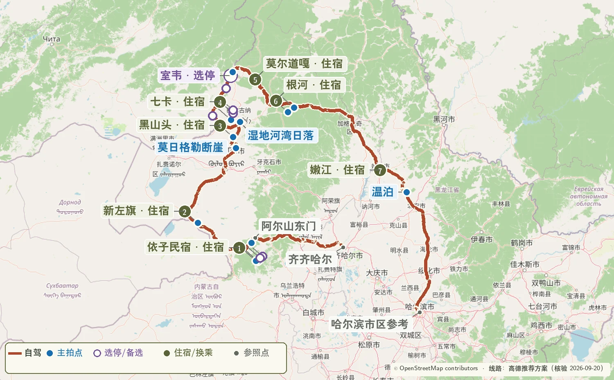
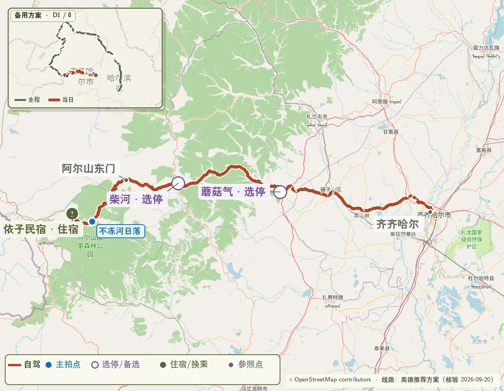
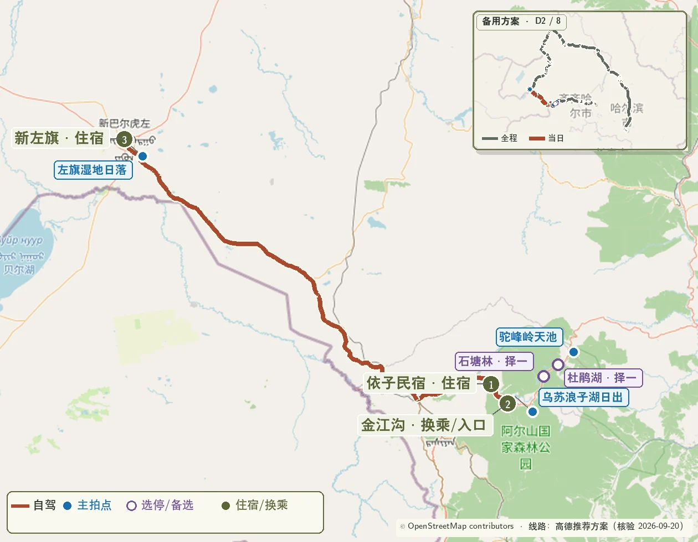
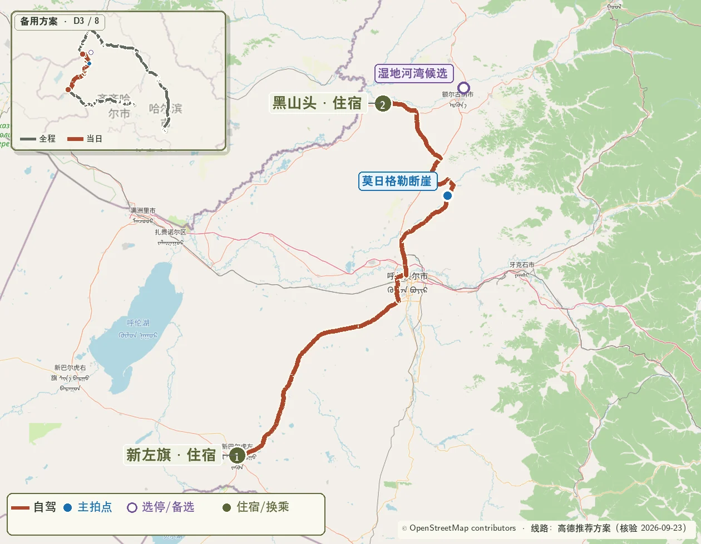
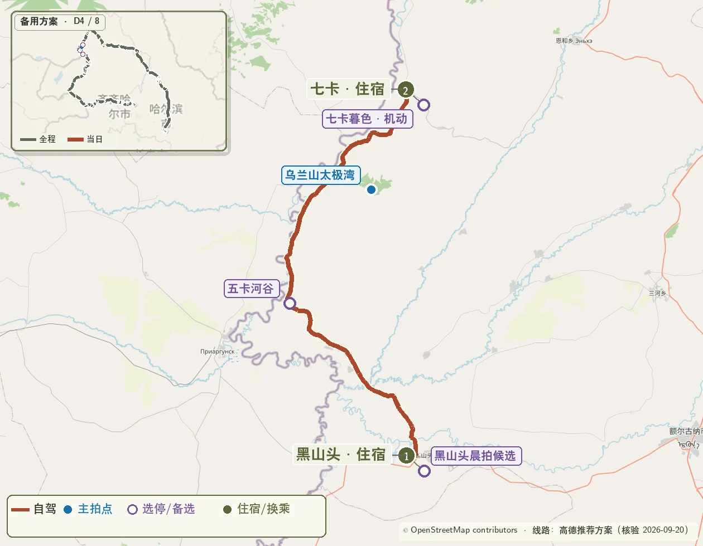
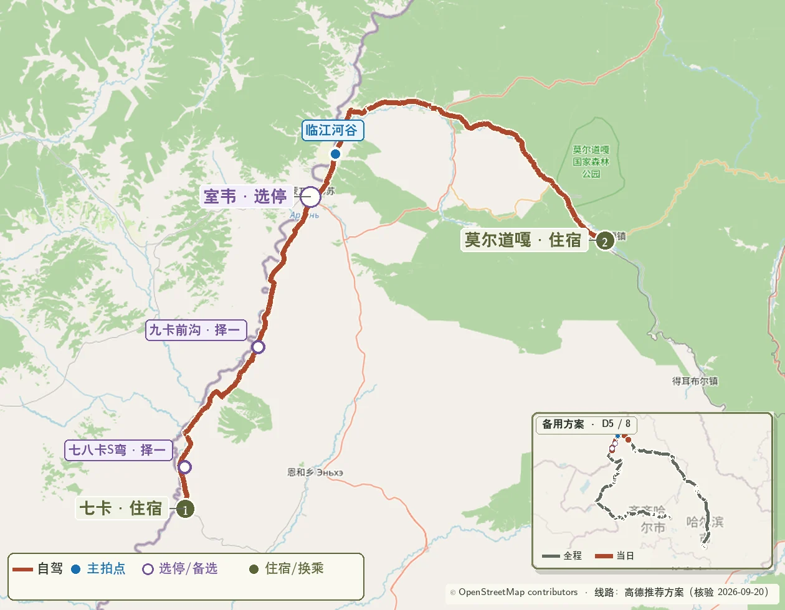
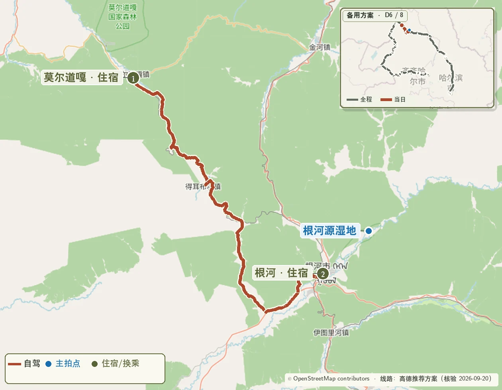
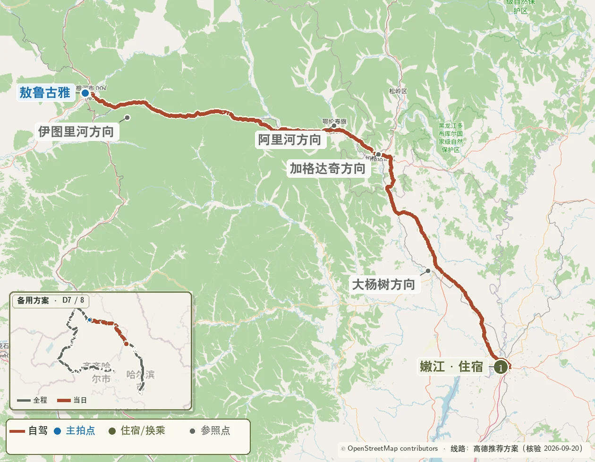
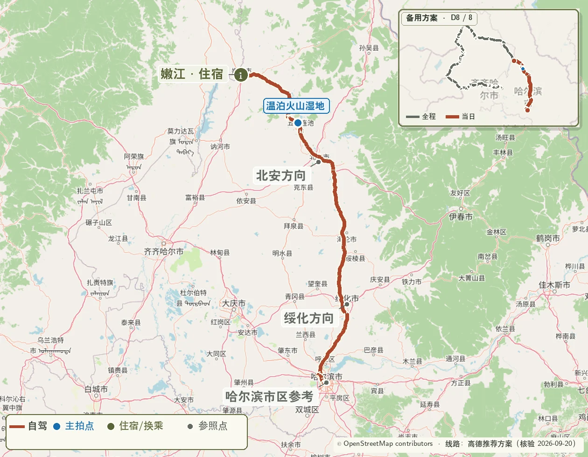

> 使用条件：奇乾住宿没有落实，或室韦—奇乾方向道路、天气不适合进入。 
> 核心路线：齐齐哈尔 → 蘑阿公路 → 阿尔山 → 莫日格勒河 → 黑山头 → 卡线 → 室韦 → 莫尔道嘎 → 根河 → 嫩江 → 五大连池 → 哈尔滨

{.route-map loading="eager" decoding="async" fetchpriority="high" fig-alt="以莫尔道嘎为北端住宿点的八日完整路线图"}

> 地图图例：砖红色  表示自驾路线，橄榄色  编号表示路线节点，蓝色  圆点表示重点拍摄位置。

::: {.route-strip}
[09.26 蘑阿公路 → 阿尔山](#skip-day-1) [09.27 阿尔山 → 新左旗](#skip-day-2) [09.28 莫日格勒河 → 黑山头](#skip-day-3) [09.29 卡线 → 七卡](#skip-day-4) [09.30 室韦 → 莫尔道嘎](#skip-day-5) [10.01 莫尔道嘎 → 根河](#skip-day-6) [10.02 根河 → 嫩江](#skip-day-7) [10.03 五大连池 → 哈尔滨](#skip-day-8)
:::

## 一、摘要

- 阿尔山、莫日格勒河和黑山头—七卡卡线核心段完整保留；
- 9 月 30 日住莫尔道嘎，以较短转场换取稳定睡眠和道路余量；
- 10 月 1 日约 08:00 起床，09:00 前后离开莫尔道嘎；前一日未完成林路拍摄时才补拍一次；
- 相比主行程，减少奇乾晨雾一个 S 级拍摄点，换取更稳定的睡眠和道路余量。

## 二、拍摄优先级

### S 级：整段行程的核心

- 蘑阿公路西段的秋林、河谷和火山地貌；
- 乌苏浪子湖日出与晨雾；
- 莫日格勒河高位河曲；
- 黑山头—五卡—乌兰山—七卡的卡线核心段；
- 七卡至八卡 S 弯及九卡至室韦前沟。

### A 级：天气合适时重点完成

- 阿尔山不冻河日落；
- 额尔古纳湿地日落与黑山头日出；
- 临江河谷、太平林路和莫尔道嘎秋林；
- 敖鲁古雅驯鹿与林地；
- 五大连池老黑山或温泊。

### B 级：顺路拍摄

- 新巴尔虎左旗镇东草原日落；
- 七卡暮色、根河河畔暮色；
- 重复度较高的草原、白桦林和林区道路机位。

### 地图蓝点清单

| 日期 | 蓝点拍摄地 | 执行方式 |
|---|---|---|
| 9 月 26 日 | 山水岩壁画；蘑阿西段彩林河谷停车带；不冻河日落 | 蘑阿两次短停，不冻河为固定日落机位 |
| 9 月 27 日 | 乌苏浪子湖；驼峰岭天池；杜鹃湖；石塘林；新左旗草原 | 晨拍固定；园区按光线选 1—2 个；草原日落机动执行 |
| 9 月 28 日 | 莫日格勒河高位河曲；额尔古纳湿地 | 河曲为白天核心，湿地为主日落机位 |
| 9 月 29 日 | 黑山头日出；五卡河谷；乌兰山太极湾；七卡暮色 | 日出后补觉；五卡与乌兰山优先；七卡看体力与云量 |
| 9 月 30 日 | 七卡河谷日出（天气备选）；七八卡 S 弯；九卡前沟；临江南山；太平林路；莫尔道嘎林路 | 黑山头日出未获得有效晨景、七卡次晨雾或层云合适时启用日出备选；其余时间按常规 08:00 起床。前两处道路机位优先；临江南山只在路面干燥时进入 |
| 10 月 1 日 | 根河河畔 | 09:00 直接离开莫尔道嘎；仅前一日因天气未拍到林路时补拍一次 |
| 10 月 2 日 | 敖鲁古雅驯鹿；林海公路停车带 | 驯鹿为上午核心，长转场只保留一次道路短停 |
| 10 月 3 日 | 老黑山；温泊 | 根据开放状态、能见度和风力二选一 |

## 三、日出与日落参考

以下时间用于安排到位节奏。前一晚按小时级云量、雾、降水和风重新确认；日出机位提前约 35—45 分钟、日落机位提前约 45—60 分钟到达。

| 日期 | 拍摄地 | 日出 | 日落 | 建议到位时间 |
|---|---|---:|---:|---:|
| 9 月 26 日 | 阿尔山不冻河 | 05:49 | 17:51 | 17:00—17:05 |
| 9 月 27 日 | 乌苏浪子湖 | 05:50 | 17:49 | 05:10—05:15 |
| 9 月 28 日 | 额尔古纳 | 05:53 | 17:47 | 16:45—17:00 |
| 9 月 29 日 | 黑山头 | 05:57 | 17:47 | 05:15—05:20 |
| 9 月 30 日 | 七卡（天气备选） | 05:59 | 17:44 | 05:15—05:20；满足替换条件时执行 |
| 10 月 1 日 | 根河 | 05:53 | 17:34 | 16:30 前抵达暮色机位 |

## 四、逐日行程

### Day 1｜9 月 26 日：齐齐哈尔—蘑阿公路—阿尔山 {#skip-day-1}

{.route-map loading="lazy" decoding="async" fig-alt="方案一第一天齐齐哈尔经蘑阿公路到阿尔山路线图"}

**路线**：齐齐哈尔 → 龙江 → 碾子山 → 蘑菇气 → 柴河 → 蘑阿公路 → 阿尔山国家森林公园。

**里程与驾驶**：约 390—430 公里，全天约 9—10 小时。住宿阿尔山国家森林公园内或天池服务区附近。

| 时间 | 安排 |
|---|---|
| 06:30 | 齐齐哈尔直接出发 |
| 09:10—09:25 | 蘑菇气补油、短休 |
| 10:50—11:20 | 柴河简餐、补给 |
| 11:20—15:40 | 蘑阿公路西段，安排三次正规停车带短停 |
| 15:40—16:30 | 入住或换乘园区接驳 |
| 17:00—18:15 | 不冻河日落与蓝调 |

**摄影**：山水岩壁画、彩林河谷停车带、不冻河。28–70mm 拍道路和林层，16–28mm 拍河流前景；无人机按园区和保护区现场规则执行。

**道路**：齐齐哈尔至蘑菇气采用龙江—碾子山直达线，不向北绕行甘南、阿荣旗和扎兰屯。

### Day 2｜9 月 27 日：阿尔山—新巴尔虎左旗 {#skip-day-2}

{.route-map loading="lazy" decoding="async" fig-alt="方案一第二天阿尔山园区到新巴尔虎左旗路线图"}

**里程与驾驶**：约 260—300 公里，纯驾驶约 4—5 小时。住宿新巴尔虎左旗阿木古郎镇。

| 时间 | 安排 |
|---|---|
| 04:50 | 起床 |
| 05:10—06:40 | 乌苏浪子湖日出、晨雾与倒影 |
| 06:50—08:15 | 早餐、休整、退房 |
| 08:30—10:45 | 驼峰岭天池、杜鹃湖、石塘林中选择 1—2 个 |
| 11:15 | 离开园区 |
| 12:30—13:10 | 阿尔山市午餐、加满油 |
| 13:10—16:00 | 前往新巴尔虎左旗 |
| 17:10—18:05 | 镇东草原日落 |

**摄影**：乌苏浪子湖固定执行；下午若光线和体力合适，就在新巴尔虎左旗近郊完成草原日落。

**交通**：园区景点之间使用景区接驳；完成园内拍摄并返回停车点取车后，再自驾前往阿尔山市和新巴尔虎左旗。

### Day 3｜9 月 28 日：新左旗—莫日格勒河—黑山头 {#skip-day-3}

{.route-map loading="lazy" decoding="async" fig-alt="方案一第三天经海拉尔、莫日格勒河和额尔古纳到黑山头路线图"}

**里程与驾驶**：约 340—380 公里，纯驾驶约 6—7 小时。住宿黑山头。

| 时间 | 安排 |
|---|---|
| 07:30 | 起床 |
| 08:10 | 新巴尔虎左旗出发 |
| 11:00—11:30 | 海拉尔补油、简餐 |
| 12:15—14:15 | 按当天规则使用景交车或官方代驾完成莫日格勒河观景线 |
| 15:40—17:25 | 额尔古纳湿地 |
| 17:25—18:10 | 湿地日落；闭园较早时沿黑山头方向择安全位置 |
| 18:10—19:20 | 前往黑山头入住 |

**摄影**：莫日格勒河曲线优先于湿地日落；海拉尔只承担补给和穿行功能。

**交通**：提前两天确认社会车辆准入、景交车、官方代驾和南北游客中心取车方式。社会车辆不能连续穿越且无法在北端取车时，只完成可达的高位河曲并返回原停车点，最晚 14:15 沿景区外道路前往额尔古纳。

### Day 4｜9 月 29 日：黑山头—卡线—七卡 {#skip-day-4}

{.route-map loading="lazy" decoding="async" fig-alt="方案一第四天黑山头沿卡线到七卡路线图"}

**里程与驾驶**：约 80—110 公里，以停车带拍摄为主。住宿七卡。

| 时间 | 安排 |
|---|---|
| 05:10—06:40 | 黑山头日出 |
| 06:50—10:00 | 早餐、补觉、整理器材 |
| 10:30 | 离开黑山头 |
| 11:20—11:40 | 五卡河谷短停 |
| 12:15—13:20 | 乌兰山太极湾 |
| 14:00—16:30 | 卡线正规停车带随拍 |
| 17:00 | 七卡入住 |
| 17:10—18:05 | 天气合适时拍七卡暮色 |

**摄影**：长焦端压缩界河与草原层次，广角端拍道路引导线；边境设施附近不停车、不起飞无人机。

### Day 5｜9 月 30 日：七卡—室韦—临江—太平—莫尔道嘎 {#skip-day-5}

{.route-map loading="lazy" decoding="async" fig-alt="方案一第五天七卡经室韦、临江和太平到莫尔道嘎路线图"}

**里程与驾驶**：约 200—230 公里，纯驾驶约 5—6 小时。住宿莫尔道嘎镇。

| 时间 | 安排 |
|---|---|
| 05:15—06:45（天气备选） | 黑山头日出未获得有效晨景、七卡次晨雾或层云合适时拍摄七卡河谷日出；条件不成立时继续休息 |
| 06:50—08:00（执行备选时） | 返回住宿补觉、早餐 |
| 08:00 | 常规起床；执行晨拍时结束补觉、整理行李 |
| 09:00 | 七卡出发 |
| 09:40—10:40 | 八卡、九卡各一次短停 |
| 11:05—11:50 | 室韦加油、提前午餐 |
| 11:50 | 确认临江—太平直连道路开放且干燥；条件不成立时跳过临江 |
| 12:00—12:35 | 条件成立时拍摄临江河谷；南山只在路面干燥时进入 |
| 13:20—13:40 | 太平林区短停 |
| 14:40—16:40 | 莫尔道嘎外围林路与安全停车点 |
| 17:00 前后 | 入住、晚餐、完整休息 |

**摄影**：七卡日出用于替换未成片的黑山头日出，不叠加为两次固定早起；随后拍摄七卡至八卡 S 弯、九卡前沟、临江南山、太平林路和莫尔道嘎秋林。17:00 前后入住优先，日落作为沿途机动拍摄。

**道路**：临江—太平直连道路不可用时，不先进入临江再折返；从室韦按实时导航直接前往太平或莫尔道嘎。

### Day 6｜10 月 1 日：莫尔道嘎—根河 {#skip-day-6}

{.route-map loading="lazy" decoding="async" fig-alt="方案一第六天莫尔道嘎到根河路线图"}

**里程与驾驶**：约 130—170 公里，按绕行情况约 3.5—4.5 小时。住宿根河。

| 时间 | 安排 |
|---|---|
| 08:00 | 起床、早餐 |
| 09:00 | 加满油后离开莫尔道嘎；仅前一日因天气未完成林路拍摄时补拍 30—45 分钟 |
| 12:30—13:10 | 沿途简餐、驾驶员休息 |
| 15:00—16:00 | 抵达根河并入住 |
| 16:30—17:45 | 根河河畔与林缘暮色，按天气择机 |

**道路**：按临行公告选择 X954—X325—G332 通行组合；莫尔道嘎林路以 9 月 30 日为主拍，10 月 1 日只保留天气补拍，不重复安排固定停留。

### Day 7｜10 月 2 日：根河—敖鲁古雅—嫩江 {#skip-day-7}

{.route-map loading="lazy" decoding="async" fig-alt="方案一第七天根河经敖鲁古雅、阿里河和加格达奇到嫩江路线图"}

**里程与驾驶**：约 470—520 公里，纯驾驶约 7.5—8.5 小时。住宿嫩江。

| 时间 | 安排 |
|---|---|
| 08:00 | 起床 |
| 09:00—10:30 | 敖鲁古雅驯鹿与林地 |
| 10:45 | 从根河继续南下 |
| 12:30—13:05 | 伊图里河或甘河简餐 |
| 14:30—14:55 | 阿里河补给 |
| 16:00—16:30 | 加格达奇加满油、休息 |
| 19:30—20:30 | 抵达嫩江 |

**摄影**：上午专注驯鹿与林地环境；长转场只保留一次林海公路短停，每连续驾驶约 2 小时主动休息。

### Day 8｜10 月 3 日：嫩江—五大连池—哈尔滨 {#skip-day-8}

{.route-map loading="lazy" decoding="async" fig-alt="方案一第八天嫩江经五大连池到哈尔滨路线图"}

**里程与驾驶**：约 520—580 公里，纯驾驶约 6.5—7.5 小时。

| 时间 | 安排 |
|---|---|
| 08:00 | 起床、早餐 |
| 08:45 | 嫩江出发 |
| 10:45—11:15 | 抵达五大连池游客服务中心 |
| 11:15—13:30 | 晴朗选老黑山；阴天或大风选温泊 |
| 13:30—14:15 | 简餐、加满油 |
| 14:30 | 最晚离开五大连池 |
| 19:00—20:00 | 抵达哈尔滨并完成还车衔接 |

**执行重点**：五大连池只完成一个核心区，14:30 为硬离场时间；为国庆车流和还车手续保留余量。

## 五、摄影器材配置

### Canon R5 Mark II

**28–70mm F2.8**

- 作为道路、河谷、草原、林区和驯鹿环境照的全程主力；
- 50–70mm 端用于压缩莫日格勒河曲、卡线界河与层叠秋林。

**16–28mm F2.8**

- 用于乌苏浪子湖、不冻河、额尔古纳湿地和温泊；
- 拍摄道路近景时保持地平线水平，避免远景主体过小。

**随车附件**

- 三脚架、CPL、防雨罩、镜头布、气吹和薄手套；
- 相机备用电池不少于 3 块，双卡记录并准备两份素材备份；
- 车载逆变器或多口充电器，长转场当天在车内完成轮换充电。

### DJI Air 3S

- 莫日格勒河、非边境敏感区域的草原道路和林区道路可在适飞、允许且风力合适时使用；
- 阿尔山保护区、卡线、七卡及其他边境路段以现场规定为准；
- 出现大风、低云、降水或低温快速掉电时保持收纳，返航电量预留不少于 30%；
- 不追飞驯鹿、牧群，不贴近民居、车辆和边防设施。

## 六、住宿与预约

### 优先预订

1. **阿尔山园区内住宿：9 月 26 日** 
   确认不冻河日落、乌苏浪子湖日出接驳和车辆停放位置。

2. **七卡住宿：9 月 29 日** 
   房量有限，优先锁定可取消、有停车位并能提供晚餐的房型。

### 灵活预订

- 新巴尔虎左旗、黑山头、莫尔道嘎、根河和嫩江选择可取消房型；
- 莫尔道嘎住宿选择方便次日驶向 X954—X325—G332 的位置；
- 每天中午前确认当晚住宿、停车和供暖，10 月 2 日的嫩江酒店优先靠近次日南下主路。

## 七、车辆与补给

- 使用离地间隙较高、轮胎状态良好的 SUV，出发前检查备胎、胎压、玻璃水和随车工具；
- 在阿尔山市、海拉尔、室韦、莫尔道嘎、根河和加格达奇主动加满油；
- 七卡至莫尔道嘎、莫尔道嘎至根河按林区路段准备饮水、热量食品和保温衣物；
- 下载高德、百度和离线地图，保存住宿电话、加油点与关键机位；
- 雨后不进入草地土路和临江南山松软路段；每天出发前确认施工绕行、轮胎、油量和续航；
- 10 月 2 日长转场每连续驾驶约 2 小时主动休息，16:30 后不再增加支路拍摄。

## 八、每日执行清单

### 天气确认节奏

- **T-7 日**：判断阿尔山、卡线、莫尔道嘎和返程方向的降温、降水与大风趋势；
- **T-72 小时**：按小时级预报调整日出、日落和长转场节奏；
- **前一晚 20:00**：锁定次日起床、首个机位、主拍点、备用点和最晚离场时间；
- **出发前**：复核气象预警、实时降水、能见度、阵风、路面结冰与道路公告。天气与道路入口见[核验页](sources.qmd#四施工天气与森林安全)。

### 当日天气决策表

| 日期 | 重点确认 | 当天执行规则 |
|---|---|---|
| 9 月 26 日 | 蘑阿降水和低云；阿尔山傍晚云量与风 | 湿滑时缩减沿途短停；日落条件关闭时直接入住 |
| 9 月 27 日 | 乌苏浪子湖雾、低云和降水；新左旗傍晚云量 | 能见度可用时晨拍；下午无好光就取消草原日落并休息 |
| 9 月 28 日 | 莫日格勒河能见度、风及车辆接驳规则；额尔古纳西侧云量 | 河曲清晰且车辆能在北端衔接时完成观景线；无法连续穿越时返回停车点，再沿景区外道路前往额尔古纳 |
| 9 月 29 日 | 黑山头晨雾；卡线降水、阵风与路面 | 晨雾成立时执行日出；雨后只走铺装主线，湿滑时不进乌兰山支路 |
| 9 月 30 日 | 七卡日出前雾、低云与能见度；临江—太平直连道路；七卡—莫尔道嘎降水和林区路面 | 黑山头晨拍未获得有效画面且七卡晨雾或层云合适时，05:15 到位启用七卡日出备选；其余情况按 08:00 起床。直连道路关闭或泥泞时跳过临江；持续降水时保留 S 弯后直接前往莫尔道嘎 |
| 10 月 1 日 | 莫尔道嘎—根河道路；根河傍晚云量 | 默认 09:00 离开莫尔道嘎；仅前一日未完成林路拍摄时补拍一次，暮色条件普通则提前休息 |
| 10 月 2 日 | 根河至嫩江降水、降温和结冰风险 | 路况正常保留敖鲁古雅；雨雪或结冰时压缩停留并优先完成山区路段 |
| 10 月 3 日 | 五大连池能见度、降水、风和国庆车流 | 晴朗选老黑山；阴天或风大选温泊；恶劣天气或拥堵明显时直达哈尔滨 |

### 出发前

- 检查油量、胎压、导航、离线地图和当天施工绕行；
- 相机双卡、时间同步、电池、无人机电量与适飞空域检查；
- 将当日住宿、加油站、核心机位和最晚离场点设为收藏；
- 按天气把拍摄点标记为“必拍、顺路、备用”三级。

### 拍摄结束后

- 相机素材至少完成两份备份，核对照片数量与关键机位；
- 清洁镜片、检查器材受潮情况，轮换补充相机和无人机电量；
- 联系次日住宿，确认停车、晚餐、供暖和道路信息；
- 按最新小时级天气更新次日起床时间、机位和最晚离场时间。
