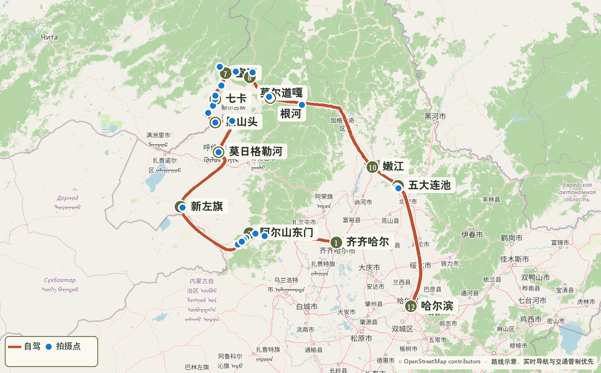
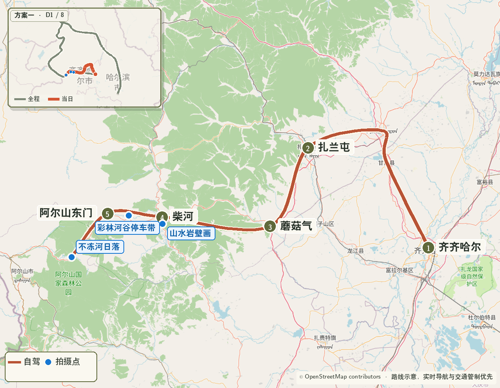
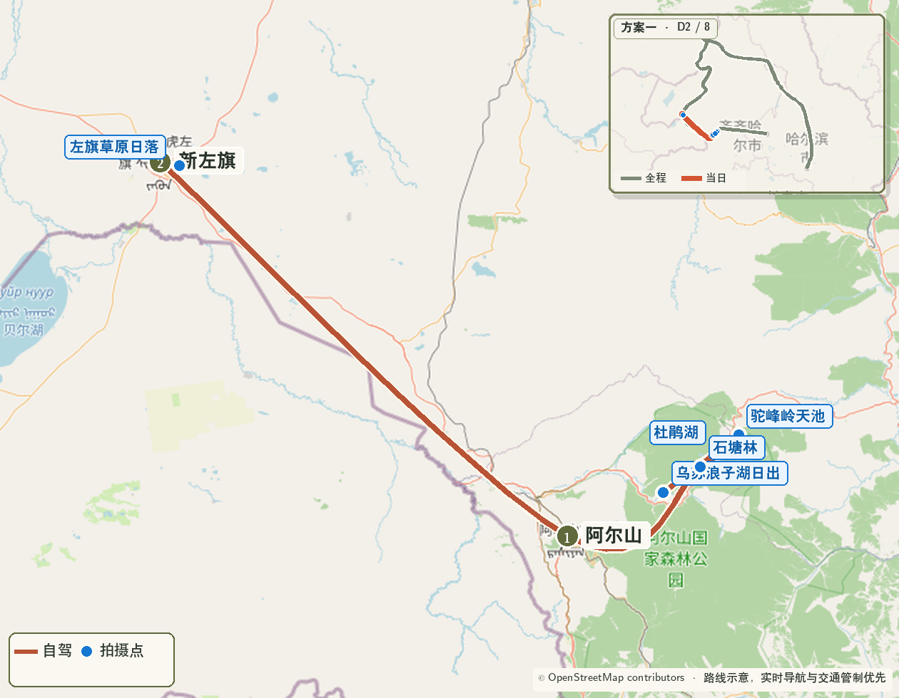
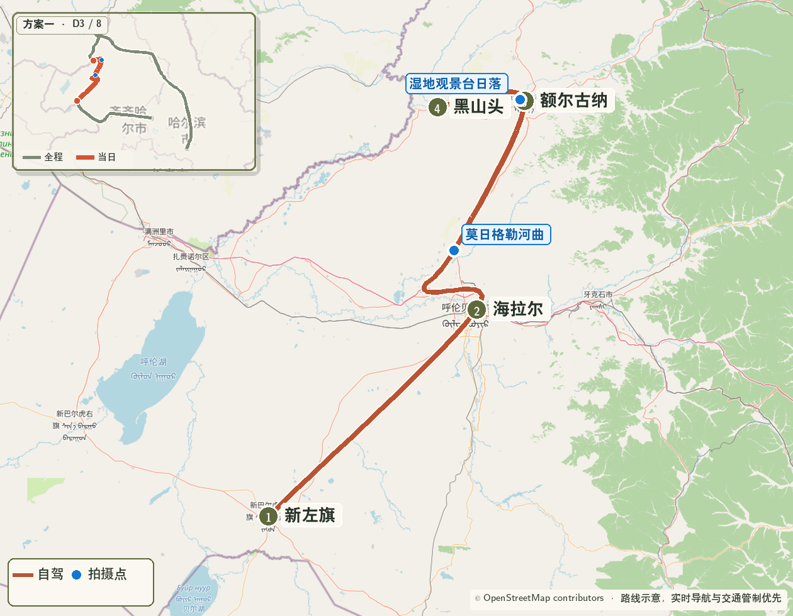
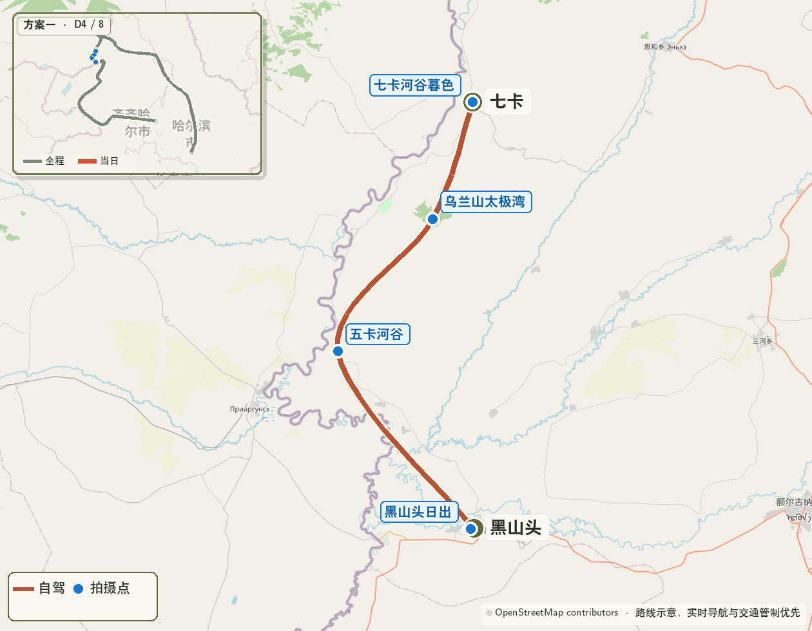
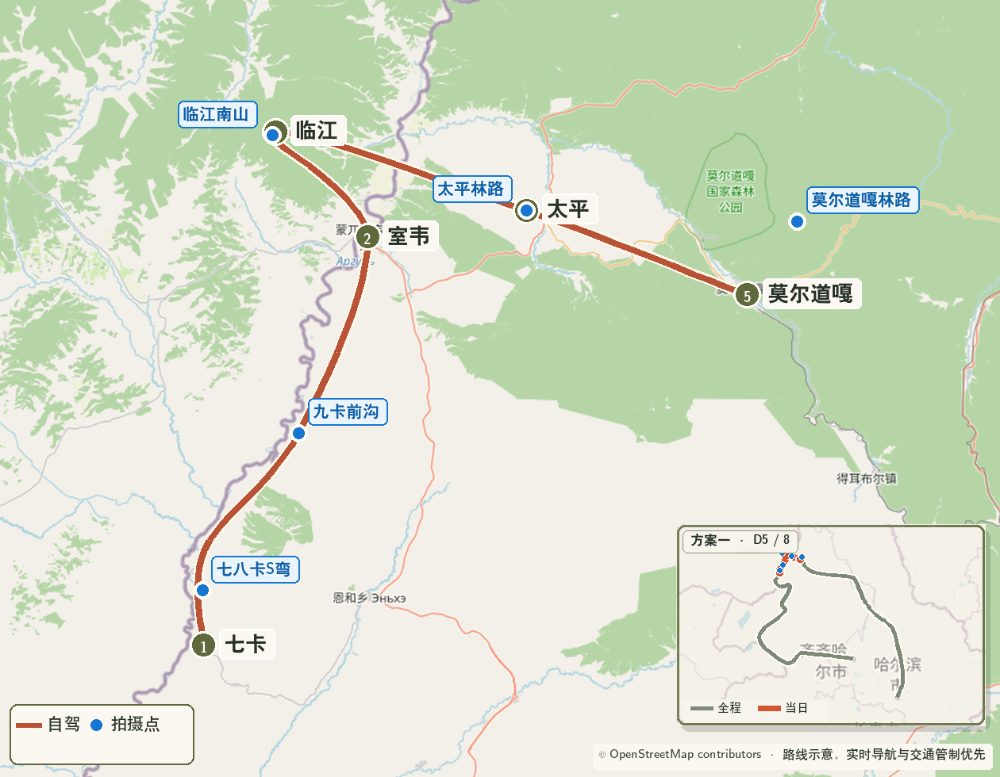
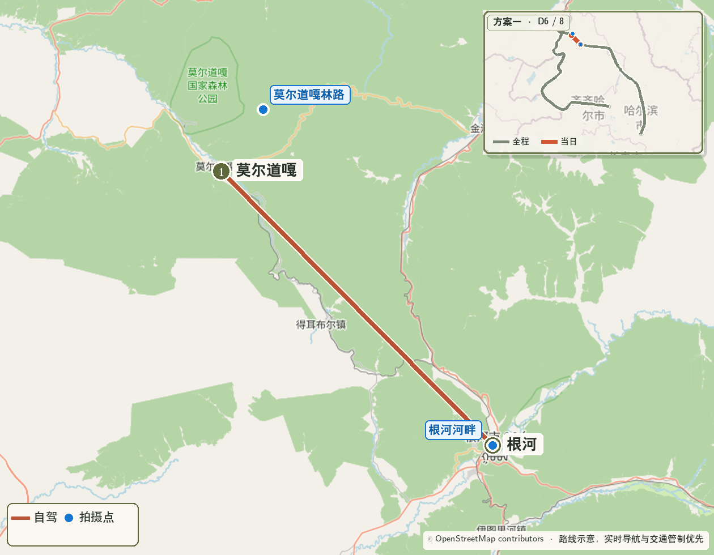
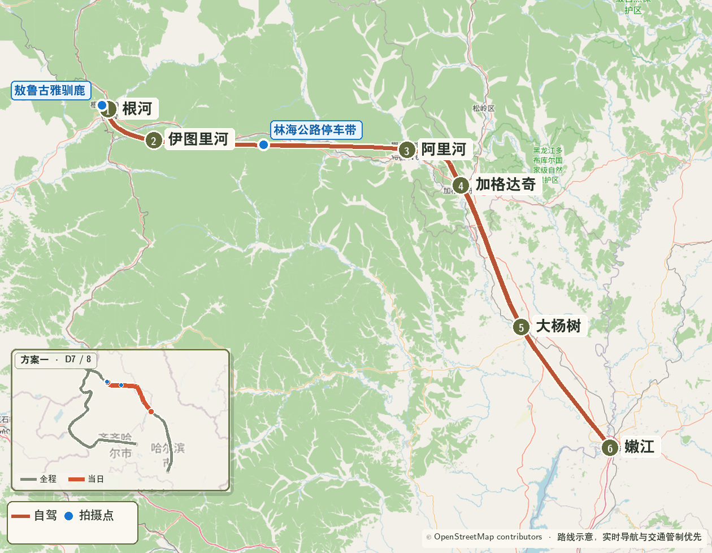
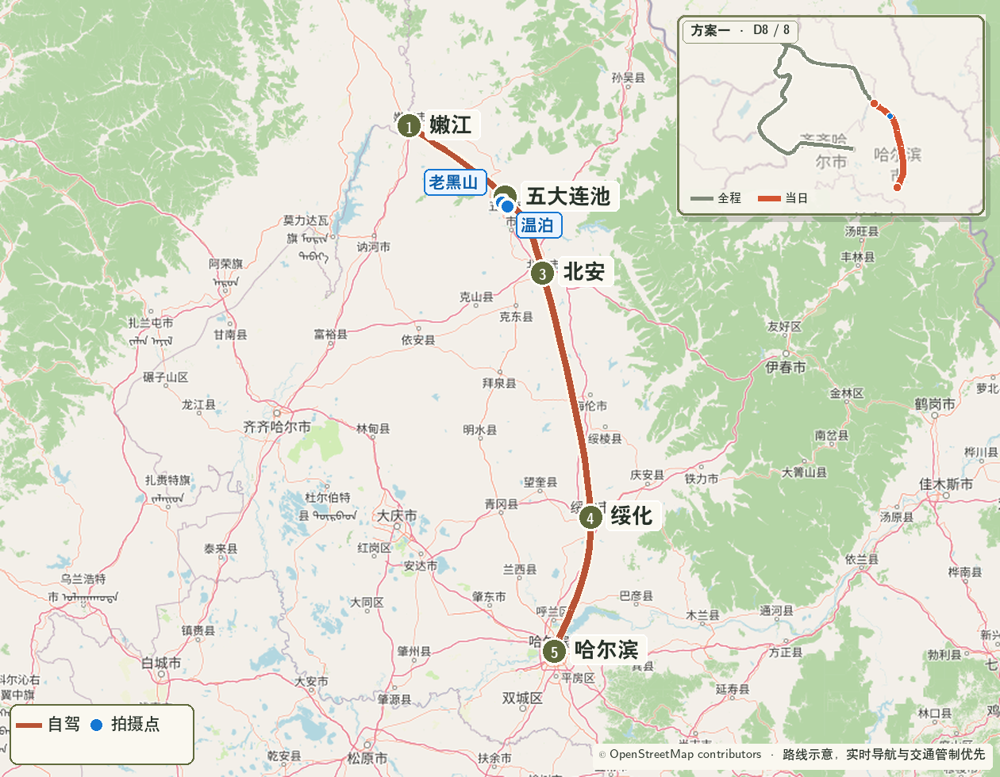

> 使用条件：奇乾住宿没有落实，或室韦—奇乾方向道路、天气不适合进入。  
> 核心路线：齐齐哈尔 → 蘑阿公路 → 阿尔山 → 莫日格勒河 → 黑山头 → 卡线 → 室韦 → 莫尔道嘎 → 根河 → 嫩江 → 五大连池 → 哈尔滨

{.route-map fig-alt="不进入奇乾、在莫尔道嘎住宿的八日完整路线图"}

> 地图图例：砖红色  表示自驾路线，橄榄色  编号表示路线节点，蓝色  圆点表示重点拍摄位置。

::: {.route-strip}
[09.26 蘑阿公路 → 阿尔山](#skip-day-1) [09.27 阿尔山 → 新左旗](#skip-day-2) [09.28 莫日格勒河 → 黑山头](#skip-day-3) [09.29 卡线 → 七卡](#skip-day-4) [09.30 室韦 → 莫尔道嘎](#skip-day-5) [10.01 莫尔道嘎 → 根河](#skip-day-6) [10.02 根河 → 嫩江](#skip-day-7) [10.03 五大连池 → 哈尔滨](#skip-day-8)
:::

## 一、方案重点

- 阿尔山、莫日格勒河和黑山头—七卡卡线核心段完整保留；
- 9 月 30 日住莫尔道嘎，取消前往奇乾的偏远往返和最后一段夜路；
- 10 月 1 日约 08:00 起床，从容拍摄莫尔道嘎林区后前往根河；
- 相比主行程，减少奇乾晨雾一个 S 级拍摄点，换取更稳定的睡眠和道路余量。

## 二、逐日行程

### Day 1｜9 月 26 日：齐齐哈尔—蘑阿公路—阿尔山 {#skip-day-1}

{.route-map fig-alt="方案一第一天齐齐哈尔经蘑阿公路到阿尔山路线图"}

**里程与驾驶**：约 460—500 公里，全天约 10—11 小时。住宿阿尔山国家森林公园内或天池服务区附近。

| 时间 | 安排 |
|---|---|
| 06:30 | 齐齐哈尔直接出发 |
| 09:10—09:25 | 蘑菇气补油、短休 |
| 10:50—11:20 | 柴河简餐、补给 |
| 11:20—15:40 | 蘑阿公路西段，安排三次正规停车带短停 |
| 15:40—16:30 | 入住或换乘园区接驳 |
| 17:00—18:15 | 不冻河日落与蓝调 |

**摄影**：山水岩壁画、彩林河谷停车带、不冻河。28–70mm 拍道路和林层，16–28mm 拍河流前景；无人机按园区和保护区现场规则执行。

### Day 2｜9 月 27 日：阿尔山—新巴尔虎左旗 {#skip-day-2}

{.route-map fig-alt="方案一第二天阿尔山园区到新巴尔虎左旗路线图"}

**里程与驾驶**：约 260—300 公里，纯驾驶约 4—5 小时。住宿新巴尔虎左旗阿木古郎镇。

| 时间 | 安排 |
|---|---|
| 04:50 | 起床 |
| 05:10—06:40 | 乌苏浪子湖日出、晨雾与倒影 |
| 06:50—08:15 | 早餐、休整、退房 |
| 08:30—10:45 | 驼峰岭天池、杜鹃湖、石塘林中选择 1—2 个 |
| 11:15 | 离开园区 |
| 12:30—13:10 | 阿尔山市午餐、加满油 |
| 13:10—16:00 | 前往新巴尔虎左旗 |
| 17:10—18:05 | 镇东草原日落 |

**摄影**：乌苏浪子湖固定执行；下午草原日落只在光线和体力合适时完成，不增加新巴尔虎右旗往返。

### Day 3｜9 月 28 日：新左旗—莫日格勒河—黑山头 {#skip-day-3}

{.route-map fig-alt="方案一第三天经海拉尔、莫日格勒河和额尔古纳到黑山头路线图"}

**里程与驾驶**：约 340—380 公里，纯驾驶约 6—7 小时。住宿黑山头。

| 时间 | 安排 |
|---|---|
| 07:30 | 起床 |
| 08:10 | 新巴尔虎左旗出发 |
| 11:00—11:30 | 海拉尔补油、简餐 |
| 12:15—14:15 | 莫日格勒河高位河曲与自驾线 |
| 15:40—17:25 | 额尔古纳湿地 |
| 17:25—18:10 | 湿地日落；闭园较早时沿黑山头方向择安全位置 |
| 18:10—19:20 | 前往黑山头入住 |

**摄影**：莫日格勒河曲线优先于湿地日落；海拉尔只承担补给和穿行功能。

### Day 4｜9 月 29 日：黑山头—卡线—七卡 {#skip-day-4}

{.route-map fig-alt="方案一第四天黑山头沿卡线到七卡路线图"}

**里程与驾驶**：约 80—110 公里，以停车带拍摄为主。住宿七卡。

| 时间 | 安排 |
|---|---|
| 05:10—06:40 | 黑山头日出 |
| 06:50—10:00 | 早餐、补觉、整理器材 |
| 10:30 | 离开黑山头 |
| 11:20—11:40 | 五卡河谷短停 |
| 12:15—13:20 | 乌兰山太极湾 |
| 14:00—16:30 | 卡线正规停车带随拍 |
| 17:00 | 七卡入住 |
| 17:10—18:05 | 天气合适时拍七卡暮色 |

**摄影**：长焦端压缩界河与草原层次，广角端拍道路引导线；边境设施附近不停车、不起飞无人机。

### Day 5｜9 月 30 日：七卡—室韦—临江—太平—莫尔道嘎 {#skip-day-5}

{.route-map fig-alt="方案一第五天七卡经室韦、临江和太平到莫尔道嘎路线图"}

**里程与驾驶**：约 200—230 公里，纯驾驶约 5—6 小时。住宿莫尔道嘎镇。

| 时间 | 安排 |
|---|---|
| 08:00 | 起床 |
| 09:00 | 七卡出发 |
| 09:40—10:40 | 八卡、九卡各一次短停 |
| 11:05—11:50 | 室韦加油、提前午餐 |
| 12:00—12:35 | 临江河谷；南山只在路面干燥时进入 |
| 13:20—13:40 | 太平林区短停 |
| 14:40—16:40 | 莫尔道嘎外围林路与安全停车点 |
| 17:00 前后 | 入住、晚餐、完整休息 |

**摄影**：七卡至八卡 S 弯、九卡前沟、临江南山、太平林路和莫尔道嘎秋林。当天不设置固定日落，避免为了重复光线拖延入住。

### Day 6｜10 月 1 日：莫尔道嘎—根河 {#skip-day-6}

{.route-map fig-alt="方案一第六天莫尔道嘎到根河路线图"}

**里程与驾驶**：约 130—170 公里，按绕行情况约 3.5—4.5 小时。住宿根河。

| 时间 | 安排 |
|---|---|
| 08:00 | 起床、早餐 |
| 09:00—10:30 | 莫尔道嘎镇外林路与秋林短停 |
| 10:45 | 加满油后出发 |
| 12:30—13:10 | 沿途简餐、驾驶员休息 |
| 15:00—16:00 | 抵达根河并入住 |
| 16:30—17:45 | 根河河畔与林缘暮色，按天气择机 |

**道路**：按临行公告选择 X954—X325—G332 通行组合；当天的价值是恢复体力，并为次日南下保留完整睡眠。

### Day 7｜10 月 2 日：根河—敖鲁古雅—嫩江 {#skip-day-7}

{.route-map fig-alt="方案一第七天根河经敖鲁古雅、阿里河和加格达奇到嫩江路线图"}

**里程与驾驶**：约 470—520 公里，纯驾驶约 7.5—8.5 小时。住宿嫩江。

| 时间 | 安排 |
|---|---|
| 08:00 | 起床 |
| 09:00—10:30 | 敖鲁古雅驯鹿与林地 |
| 10:45 | 从根河继续南下 |
| 12:30—13:05 | 伊图里河或甘河简餐 |
| 14:30—14:55 | 阿里河补给 |
| 16:00—16:30 | 加格达奇加满油、休息 |
| 19:30—20:30 | 抵达嫩江 |

**摄影**：上午专注驯鹿与林地环境；长转场只保留一次林海公路短停，每连续驾驶约 2 小时主动休息。

### Day 8｜10 月 3 日：嫩江—五大连池—哈尔滨 {#skip-day-8}

{.route-map fig-alt="方案一第八天嫩江经五大连池到哈尔滨路线图"}

**里程与驾驶**：约 520—580 公里，纯驾驶约 6.5—7.5 小时。

| 时间 | 安排 |
|---|---|
| 08:00 | 起床、早餐 |
| 08:45 | 嫩江出发 |
| 10:45—11:15 | 抵达五大连池游客服务中心 |
| 11:15—13:30 | 晴朗选老黑山；阴天或大风选温泊 |
| 13:30—14:15 | 简餐、加满油 |
| 14:30 | 最晚离开五大连池 |
| 19:00—20:00 | 抵达哈尔滨并完成还车衔接 |

**执行重点**：五大连池只完成一个核心区，14:30 为硬离场时间；为国庆车流和还车手续保留余量。

## 三、住宿与器材

- 阿尔山园区住宿仍需提前预订；七卡房量有限，建议提前锁定可取消房型；
- 莫尔道嘎、根河和嫩江选择有停车位、方便次日出城的住宿；
- 28–70mm F2.8 为主力，16–28mm F2.8 用于湖岸、河流与大范围天空；
- DJI Air 3S 在边境路段和保护区严格按现场规则执行。

