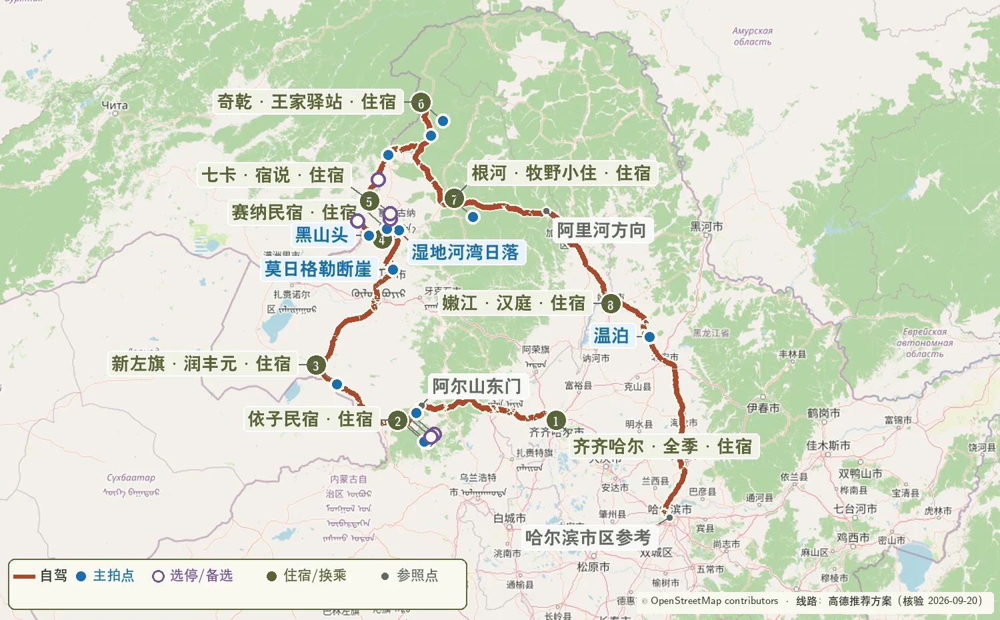
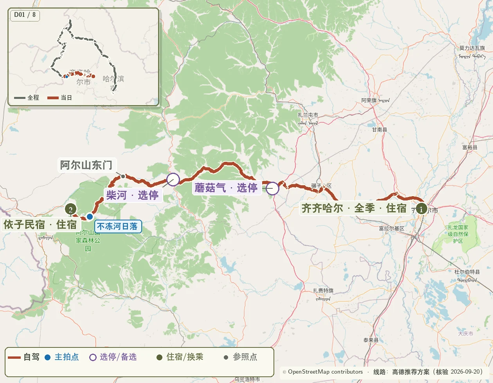
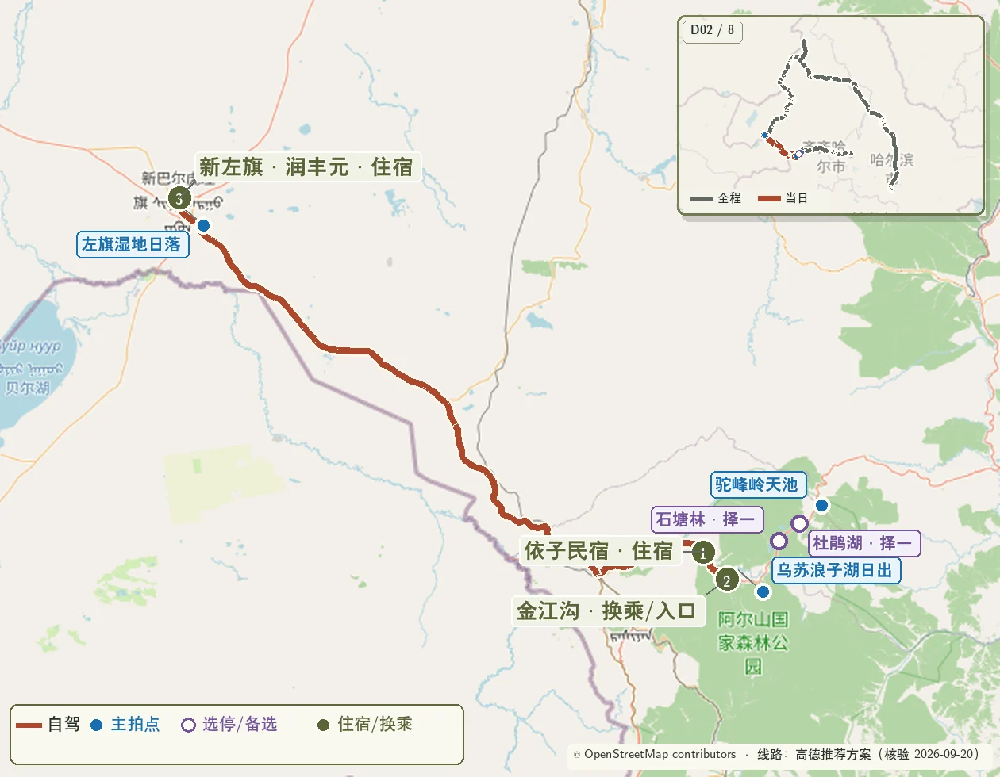
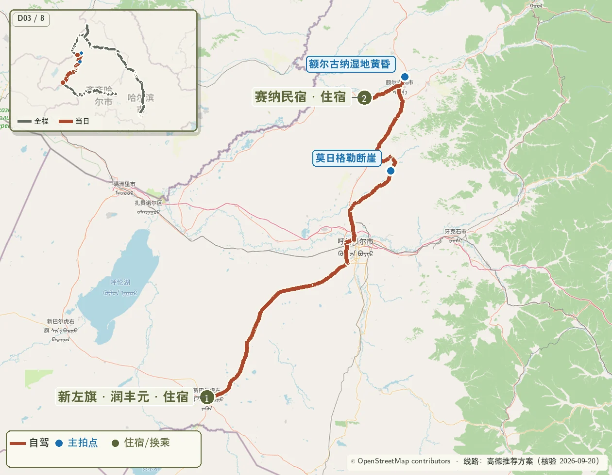
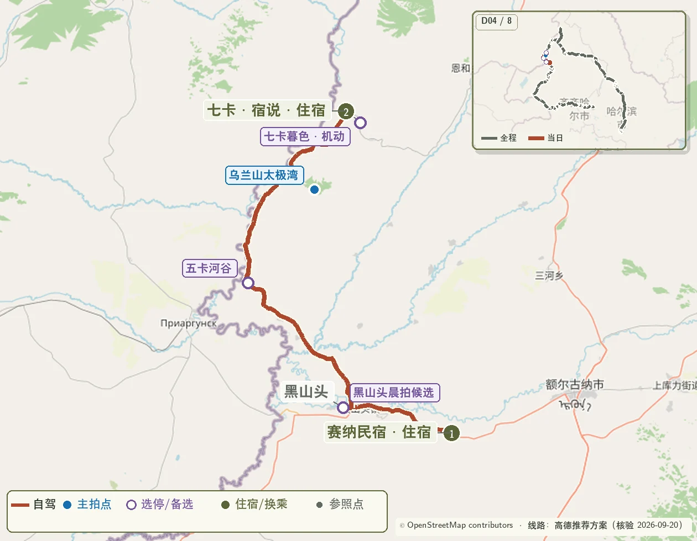
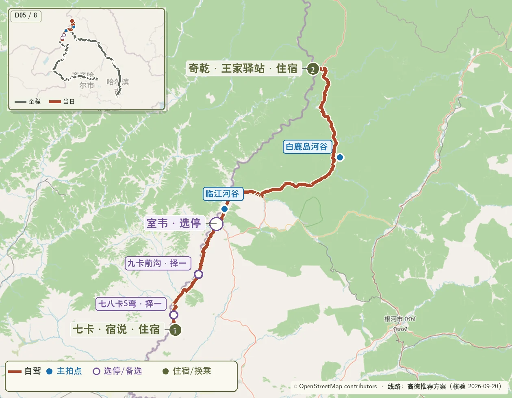
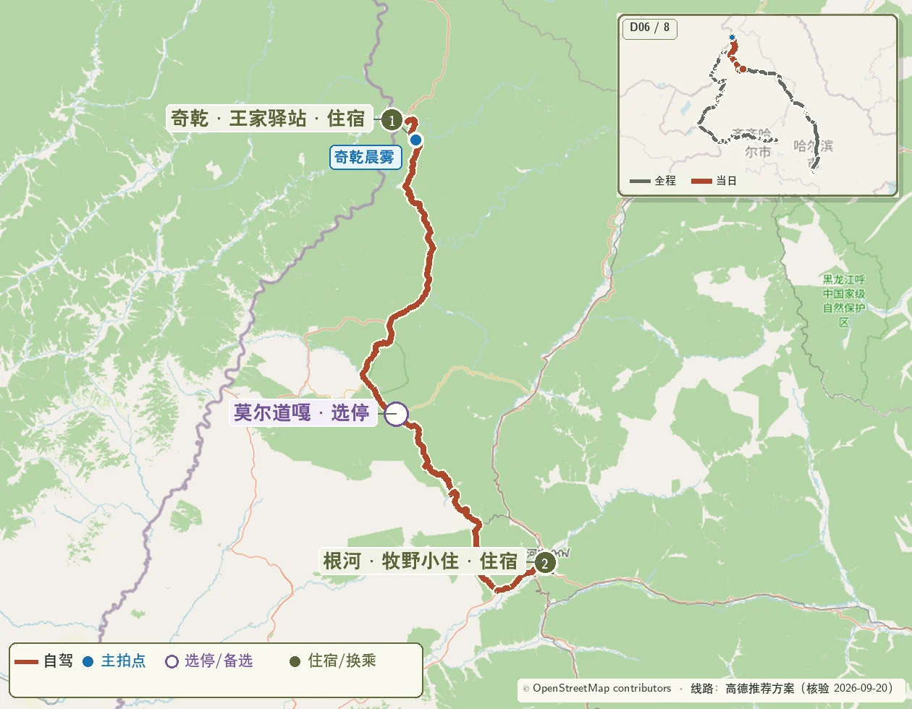
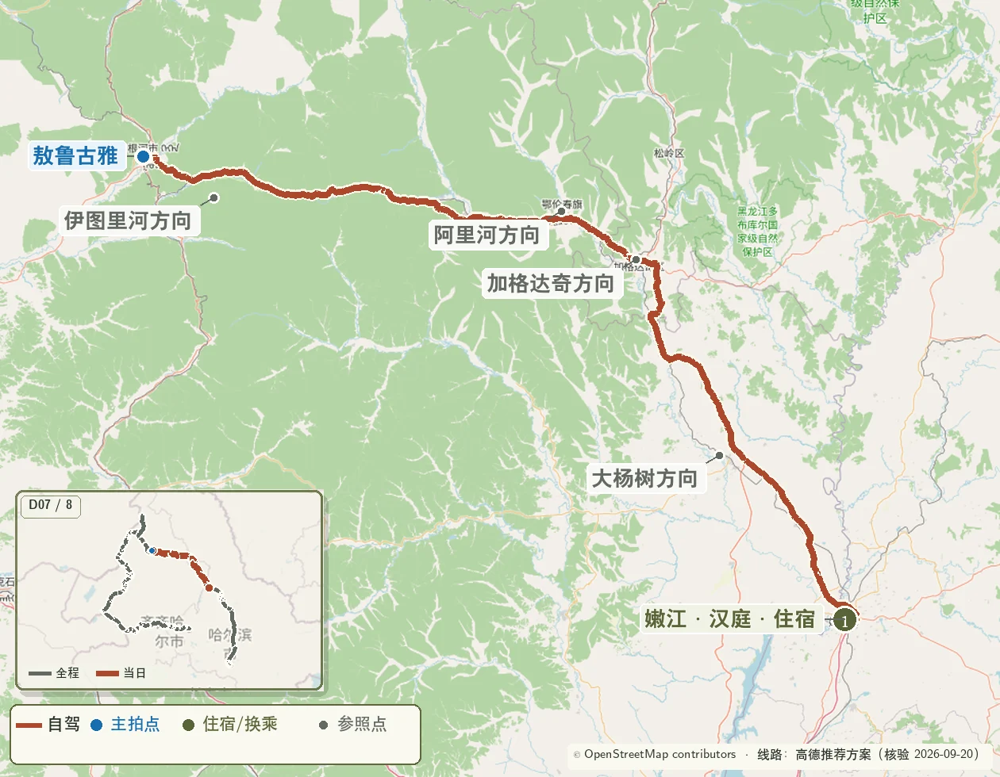
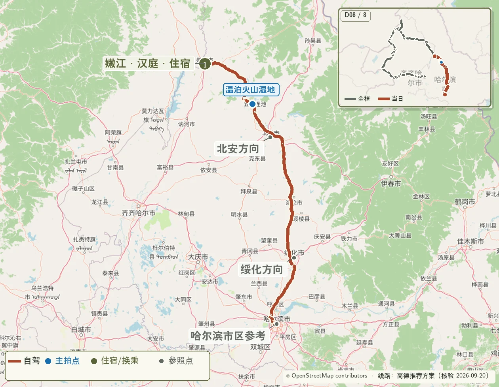

> 版本日期：2026-09-04 
> 核心路线：齐齐哈尔 → 蘑阿公路 → 阿尔山 → 新巴尔虎左旗 → 莫日格勒河北线 → 额尔古纳国家湿地公园 → 黑山头 → 卡线 → 奇乾 → 根河 → 嫩江 → 五大连池 → 哈尔滨

{.route-map loading="eager" decoding="async" fetchpriority="high" fig-alt="从齐齐哈尔经阿尔山、呼伦贝尔、卡线、奇乾、根河和五大连池到哈尔滨的完整路线图"}

> 地图图例：砖红色  表示自驾路线，琥珀色  虚线表示预约车辆或景区接驳，橄榄色  编号表示路线节点，蓝色  圆点表示重点拍摄位置。公路沿线拍摄点以现场正规停车带为准。

::: {.drone-legend}
 红色地名或红色时间行＝本路书按禁飞执行：边境敏感带不凭 DJI 解禁或现场猜测起飞，除非事先取得可核验的书面批准。琥珀色＝出发前核验：UOM 适飞只是第一关，还须同时得到景区或保护地管理方允许。
:::

> 高德链接规则：已核准的具体 POI 直接链接高德地点页；其余有明确名称的点使用高德地点搜索链接。住宿、加油和还车门店在订单地址确定后保存为准确的高德收藏点。

::: {.route-strip}
[09.26 齐齐哈尔 → 阿尔山](#day-1) [09.27 阿尔山 → 新左旗](#day-2) [09.28 新左旗 → 黑山头](#day-3) [09.29 黑山头 → 七卡](#day-4) [09.30 七卡 → 奇乾](#day-5) [10.01 奇乾 → 根河](#day-6) [10.02 根河 → 嫩江](#day-7) [10.03 嫩江 → 哈尔滨](#day-8)
:::

## 一、摘要

这套路线把最值得拍摄的路段按地理顺序串联起来，重点保留：

1. 蘑阿公路西段的森林、河谷与火山地貌；
2. 阿尔山乌苏浪子湖日出与不冻河日落；
3. 莫日格勒河北线河曲和额尔古纳国家湿地公园；
4. 黑山头至七卡的卡线核心段；
5. 七卡、室韦、临江、太平、白鹿岛至奇乾的森林边境线；
6. 奇乾村晨昏与根河周边秋林；
7. 大兴安岭林海公路与五大连池火山—堰塞湖组合。

车辆已在 9 月 25 日取妥，9 月 26 日装车后直接离开齐齐哈尔；9 月 27 日在新巴尔虎左旗附近完成日落拍摄；9 月 29 日以卡线为绝对优先；9 月 30 日按道路条件和硬截止时间串联室韦、临江、太平、白鹿岛，晚间抵达奇乾。10 月 1 日只安排全程最后一次日出早起，返程经过莫尔道嘎补给；10 月 2 日住嫩江，10 月 3 日回哈尔滨，把两段长距离转场分开执行。

## 二、拍摄优先级

### S 级：整段行程的核心

- 蘑阿公路西段沿途秋林、河谷和火山地貌；
- 乌苏浪子湖日出；
- 莫日格勒河北线河曲；断崖仅在现场明确允许时停靠；
- 五卡—乌兰山—七卡的卡线风光只用地面相机；
- 七卡—八卡—九卡卡线段只用地面相机；室韦、临江、太平、白鹿岛按核验结果决定无人机；
- 奇乾村晨雾、木屋、河谷与秋林（只用地面相机）；
- 五大连池黑龙山—火烧山火山群或堰塞湖航拍。

### A 级：天气合适时重点完成

- 阿尔山不冻河日落；
- 额尔古纳国家湿地公园完整湿地拍摄；
- 黑山头日出；
- 根河及大兴安岭腹地秋林。

### B 级：顺路拍摄

- 新巴尔虎左旗附近草原日落；
- 沿途重复度较高的草原、白桦林和河谷机位。

### 地图蓝点清单

| 日期 | 蓝点拍摄地 | 执行方式 |
|---|---|---|
| 9 月 26 日 | 山水岩壁画；蘑阿西段彩林河谷停车带；不冻河观景台日落 | 蘑阿沿线三次短停，不冻河为固定日落机位 |
| 9 月 27 日 | 乌苏浪子湖日出；驼峰岭天池；杜鹃湖；石塘林；新左旗镇东草原日落 | 乌苏浪子湖固定；园区三点按光线选 1—2 个；草原日落顺路执行 |
| 9 月 28 日 | 莫日格勒河北线河曲；额尔古纳国家湿地公园 | 自驾终点设为阿达盖驿站；断崖只在允许时停靠；湿地公园预留至少 2 小时，航拍须同时通过 UOM 与园方核验 |
| 9 月 29 日 | 黑山头日出观测坡；五卡河谷、乌兰山太极湾、七卡河谷暮色 | 黑山头通过 UOM 与现场管理核验后以无人机为主；离开黑山头进入卡线后只用地面相机 |
| 9 月 30 日 | 七卡至八卡 S 弯、九卡卡线；临江南山、太平林路、白鹿岛河谷 | 驶离卡线前只用地面相机；室韦、临江和白鹿岛只有 UOM 与管理方均允许才起飞 |
| 10 月 1 日 | 奇乾晨雾；莫尔道嘎林路 | 奇乾只用地面相机；莫尔道嘎林路顺路择机，抵达根河后休息 |
| 10 月 2 日 | 伊图里河至阿里河林海公路停车带 | 长转场只保留一次合规航拍候选，确保当晚较早抵达嫩江 |
| 10 月 3 日 | 黑龙山—火烧山火山地貌；温泊兜底 | 火山群开放且允许航拍时优先；否则选可合规拍摄的堰塞湖岸，最后才去温泊 |

## 三、日出与日落参考

以下时间用于安排抵达机位的节奏。实际拍摄时应在日出前约 35—45 分钟、日落前约 45—60 分钟到位，并在出发前一晚通过天气软件复核云量、雾、风速和准确时间。

| 日期 | 拍摄地 | 日出 | 日落 | 建议到位时间 |
|---|---|---:|---:|---:|
| 9 月 26 日 | 阿尔山不冻河 | 05:49 | 17:51 | 17:00—17:05 |
| 9 月 27 日 | 乌苏浪子湖 | 05:50 | 17:49 | 05:10—05:15 |
| 9 月 28 日 | 额尔古纳 | 05:53 | 17:47 | 当天不以湿地公园内日落为目标 |
| 9 月 29 日 | 黑山头 | 05:57 | 17:47 | 05:15—05:20 |
| 9 月 30 日 | 七卡（天气备选） | 05:59 | 17:44 | 05:15—05:20；满足替换条件时执行 |
| 10 月 1 日 | 奇乾 | 05:56 | 17:37 | 05:15—05:20 |

## 四、逐日行程

### Day 1｜9 月 26 日：齐齐哈尔—蘑阿公路—阿尔山 {#day-1}

{.route-map loading="lazy" decoding="async" fig-alt="齐齐哈尔经龙江、碾子山、蘑菇气和柴河到阿尔山的当日路线图"}

**路线** 
齐齐哈尔 → 龙江 → 碾子山 → 蘑菇气 → 柴河 → 蘑阿公路 → 阿尔山东门 → 不冻河观景台 → 依子民宿

**里程与驾驶** 
约 390—430 公里；按 06:30—19:15 的当前时间表，全天约 12 小时 45 分钟（含用餐、三次短停与日落拍摄）。

**当晚住宿** 
依子民宿（G621 哈拉哈河 2 号大桥东南约 410 米）。提前预订；从柴河联系民宿确认晚到入住、晚餐和 9 月 27 日凌晨出入安排。

**高德导航**

::: {.daily-nav}
**自驾顺序**　齐齐哈尔已收藏住宿点 → [碾子山区](https://uri.amap.com/search?keyword=碾子山区&city=齐齐哈尔市&view=map&src=dongbei-roadbook&callnative=1) → [蘑菇气镇](https://www.amap.com/place/B01D60N39P) → [柴河月亮小镇](https://www.amap.com/place/B0FFJ8DUFQ) → [柴河源游客服务中心](https://uri.amap.com/search?keyword=柴河源游客服务中心&city=扎兰屯市&view=map&src=dongbei-roadbook&callnative=1) → [阿尔山国家森林公园东门](https://uri.amap.com/search?keyword=阿尔山国家森林公园东门&city=阿尔山市&view=map&src=dongbei-roadbook&callnative=1) → [不冻河观景台](https://www.amap.com/place/B0FFJEZTED) → [依子民宿](https://uri.amap.com/search?keyword=依子民宿&city=阿尔山市&view=map&src=dongbei-roadbook&callnative=1)

**沿途拍摄**　[山水岩壁画](https://www.amap.com/place/B01D60NC0B)作为可选停靠；蘑阿西段彩林河谷在柴河至柴河源段按正规停车带落点。
:::

**时间安排**

| 时间 | 安排 |
|---|---|
| 06:30 | 从齐齐哈尔出发 |
| 09:10—09:25 | 蘑菇气补油、短休 |
| 10:50—11:20 | 柴河简餐、补给 |
| 11:20—15:40 | 完整行驶蘑阿公路西段，安排 3 次短停拍摄 |
| 15:40—16:50 | 经阿尔山东门驶向不冻河；途中电话确认民宿晚到入住与晚餐 |
| 17:00—17:05 | 不冻河机位到位 |
| 17:10—18:15 | 拍摄蓝调前夕阳、河流反光和暮色 |
| 18:15—19:15 | 前往依子民宿，办理入住、晚餐并整理次晨器材 |

**沿途拍摄**

- 蘑阿公路优先拍摄开阔河谷、道路消失点、火山石与彩林同框；
- 每次临停控制在 10—15 分钟，优先使用正规停车带；
- 不冻河使用低机位拍摄河流前景，等待日落后的冷暖色温过渡。

**器材建议**

- Canon R5 Mark II + 28–70mm F2.8：道路、层叠山林、环境人像；
- 16–28mm F2.8：不冻河近景、倒影和大范围天空；
- DJI Air 3S：仅在允许起飞、远离保护区核心地带和人群的位置使用。

**执行重点**

- 不冻河日落优先于办理入住；从柴河联系依子民宿确认晚到入住和晚餐；
- 预计 17:05 后才能到达不冻河，或观景台不能停车时，保持过境通行并直接前往依子民宿，在民宿旁哈拉哈河 2 号桥河段完成日落备选拍摄；
- 9 月 25 日向民宿与景区确认次晨前往乌苏浪子湖的通行方式；私家车不能按时进入时，提前约好民宿车辆或当地司机；
- 9 月 25 日确认阿尔山东门至西侧住宿的过境通行；若该段不能过境，需在进入柴河前按实时导航改走阿尔山市方向；
- 齐齐哈尔至蘑菇气采用龙江—碾子山直达线，不向北绕行甘南、阿荣旗和扎兰屯；
- 园区内部停车与私家车通行规则以当日公告为准；
- 9 月 25 日晚完成加油、胎压、备胎、随车工具、离线地图和行李装车确认，9 月 26 日不再安排取车手续。

---

### Day 2｜9 月 27 日：阿尔山—新巴尔虎左旗 {#day-2}

{.route-map loading="lazy" decoding="async" fig-alt="阿尔山园区经阿尔山市到新巴尔虎左旗的当日路线图"}

**路线** 
依子民宿 → 阿尔山乌苏浪子湖渔村宾馆停车 → 乌苏浪子湖晨拍 → 金江沟游客服务中心停车 → 景交精选机位 → 返回取车 → 阿尔山市 → 阿木古郎镇（新巴尔虎左旗）

**里程与驾驶** 
约 260—300 公里，纯驾驶约 4—5 小时。

**当晚住宿** 
新巴尔虎左旗阿木古郎镇。

**高德导航**

::: {.daily-nav}
**晨拍与停车**　[依子民宿](https://uri.amap.com/search?keyword=依子民宿&city=阿尔山市&view=map&src=dongbei-roadbook&callnative=1) → [阿尔山乌苏浪子湖渔村宾馆](https://uri.amap.com/search?keyword=阿尔山乌苏浪子湖渔村宾馆&city=阿尔山市&view=map&src=dongbei-roadbook&callnative=1)停车 → 步行到乌苏浪子湖日出机位 → [金江沟游客服务中心](https://uri.amap.com/search?keyword=金江沟游客服务中心&city=阿尔山市&view=map&src=dongbei-roadbook&callnative=1)停车场。9 月 25 日确认凌晨通行和宾馆停车规则；不能自驾时使用提前预约的车辆。

**园内目标站点**　[金江沟游客服务中心](https://uri.amap.com/search?keyword=金江沟游客服务中心&city=阿尔山市&view=map&src=dongbei-roadbook&callnative=1) → [驼峰岭天池](https://uri.amap.com/search?keyword=驼峰岭天池&city=阿尔山市&view=map&src=dongbei-roadbook&callnative=1)；返程时间充足时，再从[杜鹃湖](https://uri.amap.com/search?keyword=杜鹃湖&city=阿尔山市&view=map&src=dongbei-roadbook&callnative=1)、[石塘林](https://uri.amap.com/search?keyword=石塘林&city=阿尔山市&view=map&src=dongbei-roadbook&callnative=1)中选择 1 个。收费景点间按当日调度乘景交，不设置“阿尔山天池”为目标点。

**取车后自驾**　[金江沟游客服务中心](https://uri.amap.com/search?keyword=金江沟游客服务中心&city=阿尔山市&view=map&src=dongbei-roadbook&callnative=1)停车场 → [阿尔山市](https://uri.amap.com/search?keyword=阿尔山市&city=阿尔山市&view=map&src=dongbei-roadbook&callnative=1) → [新巴尔虎左旗阿木古郎镇](https://uri.amap.com/search?keyword=阿木古郎镇&city=呼伦贝尔市&view=map&src=dongbei-roadbook&callnative=1) → 当晚已收藏住宿点。
:::

**时间安排**

| 时间 | 安排 |
|---|---|
| 04:35 | 起床，携带前夜整理好的摄影包和退房行李 |
| 04:50 | 从依子民宿出发，导航“阿尔山乌苏浪子湖渔村宾馆” |
| 05:15—06:40 | 车辆停在阿尔山乌苏浪子湖渔村宾馆，经允许后步行到湖边拍摄日出、晨雾与倒影 |
| 06:40—07:20 | 前往金江沟游客服务中心停车、简餐并衔接景交 |
| 07:30—11:30 | 驼峰岭天池优先；杜鹃湖或石塘林择 1 个 |
| 11:40 | 返回金江沟取车，离开阿尔山园区 |
| 12:40—13:20 | 阿尔山市午餐、加满油 |
| 13:20—16:10 | 前往新巴尔虎左旗 |
| 16:10—17:00 | 入住、休息、勘察镇外日落机位 |
| 17:10—18:05 | 拍摄草原日落与蓝调 |

**停车与交通**：乌苏浪子湖晨拍固定导航到阿尔山乌苏浪子湖渔村宾馆停车，不把游船码头或模糊湖岸点设为停车终点；停车须服从宾馆与现场管理，不占消防通道。收费景点之间使用景区观光车。全部行李随车放置，拍完后直接从金江沟驶向阿尔山市，不返回依子民宿。

**拍摄重点**

- 乌苏浪子湖使用 28–70mm 拍摄晨雾层次与远山倒影；
- 16–28mm 适合湖岸近景和大范围朝霞；
- 下午重点拍摄草原道路、牧场和远山，不安排新巴尔虎右旗往返，把时间留给休息和日落。

---

### Day 3｜9 月 28 日：新巴尔虎左旗—莫日格勒河北线—额尔古纳国家湿地公园—黑山头 {#day-3}

{.route-map loading="lazy" decoding="async" fig-alt="新巴尔虎左旗经海拉尔、莫日格勒河和额尔古纳到黑山头的当日路线图"}

**路线** 
新巴尔虎左旗 → 海拉尔 → 图嘎营地 → 阿达盖驿站（原北游客中心）→ 额尔古纳国家湿地公园 → 额尔古纳市区 → 黑山头

**里程与驾驶** 
约 430—500 公里；北岸土路条件成立时，纯驾驶与低速通行按 8—9.5 小时准备。

**当晚住宿** 
黑山头镇。

**高德导航**

::: {.daily-nav}
**自驾顺序**　新左旗已收藏住宿点 → 海拉尔已收藏补给点 → [图嘎营地](https://www.amap.com/place/B0I1OCCZBF) → [阿达盖驿站（原北游客中心）](https://uri.amap.com/search?keyword=阿达盖驿站&city=陈巴尔虎旗&view=map&src=dongbei-roadbook&callnative=1) → [额尔古纳国家湿地公园](https://www.amap.com/place/B0FFJ2XXCH){.drone-check} → [额尔古纳市](https://uri.amap.com/search?keyword=额尔古纳市&city=呼伦贝尔市&view=map&src=dongbei-roadbook&callnative=1) → 黑山头已收藏住宿点。

**北岸主选**　只在道路干燥、当地确认开放且车辆条件合适时，按“图嘎营地 → 阿达盖驿站”进入。沿途经过[断崖](https://www.amap.com/place/B0KDPC3LJC)附近时服从标志和工作人员管理；只有现场明确允许并有正规停车位置时才停靠，禁止把断崖设为必停终点或在路边临停。

**安全回退**　改为[呼伦贝尔大草原·莫尔格勒河景区](https://www.amap.com/place/B0JDZ5C6RX)停车，按当天管理乘观光车前往[浩林温都日驿站](https://www.amap.com/place/B0J10U123W)，不搜索来源不明的“高端观景台”。
:::

**莫日格勒河位置** 
莫日格勒河位于海拉尔以北、陈巴尔虎草原腹地。图嘎营地、阿达盖驿站、额尔古纳国家湿地公园和额尔古纳市区整体由南向北排列，再折向西去黑山头；这比先去额尔古纳市区再返回北线更顺。国家湿地公园位于市区东侧，本身会增加一段东向往返，但这是为执行指定景点而保留的有意绕行。

**时间安排**

| 时间 | 安排 |
|---|---|
| 05:40 | 起床、早餐、装车 |
| 06:20 | 从新巴尔虎左旗出发 |
| 09:00—09:25 | 海拉尔补油、简餐；再次确认图嘎至阿达盖路面、北线通行和断崖禁停状态 |
| 10:15—12:10 | 条件成立时经图嘎营地前往阿达盖驿站；断崖仅在现场明确允许时停靠；条件不成立时执行正规景区回退 |
| 12:15 | 离开莫日格勒河的硬截止；进度落后时先压缩海拉尔与莫日格勒河停留，确保湿地公园按时入园 |
| 12:15—14:10 | 前往额尔古纳国家湿地公园 |
| 14:10—16:30 | 额尔古纳国家湿地公园完整拍摄窗口；入园即先确认无人机规则，允许时以俯拍根河曲流与湿地纹理为主 |
| 16:30—19:15 | 经额尔古纳市区补给后前往黑山头；到店即入住，提前抵达时可踏勘次日日出起飞位 |

**拍摄重点**

- 莫日格勒河以北线河曲为第一优先；断崖只作条件机位，通行与停车规则高于拍摄；
- 额尔古纳只安排指定的“额尔古纳国家湿地公园”，不混用市区西侧的“额尔古纳湿地景区”；这里是当天第二核心，至少保留 2 小时；
- 28–70mm 用于压缩河曲和远处牛羊，16–28mm 用于草原大景；
- 莫日格勒河与湿地公园都以无人机画面为主，但每次起飞仍须同时通过 UOM、景区或土地管理方、风速与人流核验；不把“地图可解禁”当作允许起飞。

**执行重点**

- 出发前两天向景区或当地住宿方确认图嘎营地至阿达盖驿站道路是否开放、是否积水、车辆要求和断崖是否禁停；不以短视频口述替代当天确认；
- 北线不可达时使用正规景区观光车；12:15 后仍未离开莫日格勒河时立即转场。只有湿地公园关闭或预计 16:00 后才到入口时才取消，不为赶闭园冒险；
- 海拉尔是补给和穿行节点，可完成午餐、加油和生活物资采购；
- 当天不追赶湿地公园内日落；黑山头日落留给能提前抵达时机动执行，固定拍摄安排仍是次日日出。

---

### Day 4｜9 月 29 日：黑山头—五卡—乌兰山—七卡 {#day-4}

{.route-map loading="lazy" decoding="async" fig-alt="黑山头沿卡线经五卡和乌兰山到七卡的当日路线图"}

**路线** 
黑山头日出观测点 → 五卡 → 乌兰山 → 七卡

**里程与驾驶** 
约 80—110 公里，行车距离短，全天以卡线停走拍摄为主。

**当晚住宿** 
七卡。国庆前后住宿数量有限，建议提前预订。

**高德导航**

::: {.daily-nav}
**自驾顺序**　[黑山头日落观测点（次晨日出使用同一观测坡）](https://www.amap.com/place/B0HUKN51FP){.drone-check} → 黑山头已收藏加油站 → [五卡](https://uri.amap.com/search?keyword=五卡&city=额尔古纳市&view=map&src=dongbei-roadbook&callnative=1){.drone-no-fly} → [额尔古纳河乌兰山景区](https://www.amap.com/place/B0H2B7KCNJ){.drone-no-fly} → [七卡](https://uri.amap.com/search?keyword=七卡&city=额尔古纳市&view=map&src=dongbei-roadbook&callnative=1){.drone-no-fly}已收藏住宿点。

**卡线路径**　五卡无法搜索时直接把乌兰山景区设为下一站，确认导航全程沿 X904 和额尔古纳河方向行驶。
:::

**时间安排**

| 时间 | 安排 |
|---|---|
| 05:10 | 起床、到达黑山头日出机位；起飞前复核 UOM、现场管理、风速与人流 |
| 05:20—06:40 | 黑山头日出；核验通过时以无人机俯拍湿地、河曲和晨雾，地面相机同步兜底 |
| 06:50—10:00 | 早餐、补觉、整理摄影器材和备份素材 |
| 10:30 | 离开黑山头，进入卡线前收起无人机 |
| 11:20—11:40 | 五卡附近第一次短停，只用地面相机 |
| 12:15—13:20 | 乌兰山及周边俯瞰机位，只用地面相机 |
| 13:20—13:50 | 简餐、休息 |
| 14:00—16:30 | 卡线正规停车带随拍，只用地面相机 |
| 17:00 | 到七卡入住 |
| 17:10—18:05 | 体力与天气合适时拍摄七卡日落，只用地面相机 |

**拍摄重点**

- 黑山头日出选择草原高点；核验通过时用无人机俯拍湿地、河曲、晨雾和放牧地关系，地面长焦补充层次；
- 卡线重点捕捉道路起伏、额尔古纳河、秋色与远处村落；
- 长焦端压缩边境河谷层次，广角端拍道路引导线；
- 黑山头日出是当天唯一无人机候选；10:30 离开黑山头进入卡线后全程禁飞，即使 DJI App 显示可解禁也不视为获准。

**停车原则**

- 使用正规停车带或完全离开行车道的硬化空地；
- 弯道、坡顶、桥面和边防设施附近不停车；
- 雨后不驶入草地土路，避免陷车与破坏草场。

---

### Day 5｜9 月 30 日：七卡—室韦—临江—太平—白鹿岛—奇乾 {#day-5}

{.route-map loading="lazy" decoding="async" fig-alt="七卡经室韦、临江、太平和白鹿岛到奇乾的当日路线图"}

**路线** 
七卡 → 八卡 → 九卡 → 室韦 → 临江 → 太平 → 白鹿岛 → 奇乾

**里程与驾驶** 
约 320—380 公里，纯驾驶约 7.5—9.5 小时。太平之后直接接白鹿岛、奇乾方向，不为补给专程进入莫尔道嘎镇；七卡日出仅作天气替换项，晚间抵达奇乾。

**当晚住宿** 
奇乾村。住宿必须提前预订，同时向民宿确认车辆通行、进村登记、晚餐和次日早餐安排。

**高德导航**

::: {.daily-nav}
**第一段**　[七卡](https://uri.amap.com/search?keyword=七卡&city=额尔古纳市&view=map&src=dongbei-roadbook&callnative=1){.drone-no-fly}已收藏住宿点 → [八卡](https://uri.amap.com/search?keyword=八卡&city=额尔古纳市&view=map&src=dongbei-roadbook&callnative=1){.drone-no-fly} → [九卡](https://uri.amap.com/search?keyword=九卡&city=额尔古纳市&view=map&src=dongbei-roadbook&callnative=1){.drone-no-fly} → [室韦魅力名镇旅游区](https://www.amap.com/place/B0IK3CUHLM){.drone-check} → [临江村](https://uri.amap.com/search?keyword=临江村&city=额尔古纳市&view=map&src=dongbei-roadbook&callnative=1){.drone-check} → [老鹰嘴](https://uri.amap.com/search?keyword=老鹰嘴&city=额尔古纳市&view=map&src=dongbei-roadbook&callnative=1){.drone-check} → [太平村](https://uri.amap.com/search?keyword=太平村&city=额尔古纳市&view=map&src=dongbei-roadbook&callnative=1)。

**第二段**　[太平村](https://uri.amap.com/search?keyword=太平村&city=额尔古纳市&view=map&src=dongbei-roadbook&callnative=1) → [白鹿岛](https://uri.amap.com/search?keyword=白鹿岛&city=额尔古纳市&view=map&src=dongbei-roadbook&callnative=1){.drone-check} → [奇乾村](https://www.amap.com/place/B0FFFF8Q56){.drone-no-fly} → 已预订民宿收藏点。不要把“莫尔道嘎国家森林公园”或“莫尔道嘎镇中心”设为途经点；只有高德当天明确无法从太平接入白鹿岛方向时，才按实时导航回到莫尔道嘎。

**当日落点**　老鹰嘴、临江—太平路段和奇乾进村末段按住宿方提供的位置与当日通行信息更新；14:30 前未能驶离太平片区，或太平不能接入白鹿岛方向时，当晚住莫尔道嘎。
:::

**时间安排**

| 时间 | 安排 |
|---|---|
| 05:15—06:45（天气备选） | 七卡河谷日出，只用地面相机；条件不成立时继续休息 |
| 06:50—08:00（执行备选时） | 返回七卡住宿补觉、早餐 |
| 08:00 | 七卡常规起床；无人机继续收纳 |
| 08:30—08:55 | 七卡早餐、退房、确认奇乾民宿晚间接待方式 |
| 09:00 | 从七卡出发，卡线继续禁飞 |
| 09:40—10:00 | 八卡、九卡按光线择一短停，只用地面相机 |
| 10:30—11:10 | 抵达室韦即视为驶离卡线；加满油、提前午餐、补水和车载食品，重新核验后续机位 UOM 与现场规则 |
| 11:10 | 确认临江—太平直连道路开放且干燥；条件不成立时跳过临江 |
| 11:15—11:35 | 条件成立时拍摄临江河谷；UOM 与现场管理均允许时可短飞，否则使用地面相机或直接驶向太平 |
| 12:35—12:50 | 太平短停 |
| 12:50—14:35 | 驶离太平并确认可接入白鹿岛方向；条件不成立时转往莫尔道嘎住宿 |
| 14:35—15:45 | 白鹿岛河谷重点拍摄；只有 UOM、林区或景区管理方、现场条件全部允许时才起飞，否则改用地面长焦 |
| 15:45—19:30 | 前往奇乾；进入奇乾方向前收起无人机，天黑后不再停车拍摄 |
| 19:30—20:30 | 目标抵达奇乾，入住、晚餐，确认次日地面晨景机位 |

**拍摄重点**

- 八卡、九卡只保留一处 15 分钟左右的短停；
- 七卡日出用于替换未成片的黑山头日出，不与黑山头日出叠加为两次固定早起；
- 七卡、八卡、九卡所在卡线段以及奇乾只用地面相机；室韦、临江离开卡线后重新核验，不能把前一段禁飞结论或许可直接沿用；
- 白鹿岛是当天唯一预留的无人机主拍候选，拍河谷 S 弯、森林层次与水面关系；没有明确允许就改用地面长焦；
- 当天不追赶奇乾日落；如果行车途中自然遇到好光，只在正规停车点完成一次短拍；
- 奇乾的木屋、额尔古纳河、炊烟、林缘与晨雾集中到次日清晨拍摄。

**道路重点**

- 七卡经室韦、X954、太平、白鹿岛至奇乾按全日约 320—380 公里准备；室韦完成加油，避免为补给专程进入莫尔道嘎镇；
- G331 奇下十七桥施工期间，经 X954 按室韦—临江—太平—莫尔道嘎方向通行；
- 在室韦确认临江—太平直连道路不可用时，跳过临江并按实时导航前往太平或莫尔道嘎，不先进入临江再折返；
- 14:30 前确认太平至白鹿岛方向道路、能见度、车辆和驾驶员状态；能按时驶离太平才继续前往奇乾，否则转往莫尔道嘎并从当晚起执行备用方案；
- 夜间行车集中在最后一段，入夜后降低车速，重点留意林区动物和临时施工标志；
- 室韦加满油，车辆补给按进入偏远林区后的完整行程准备。

---

### Day 6｜10 月 1 日：奇乾晨雾—莫尔道嘎—根河 {#day-6}

{.route-map loading="lazy" decoding="async" fig-alt="奇乾经白鹿岛和莫尔道嘎到根河的当日路线图"}

**路线** 
奇乾 → 白鹿岛附近 → 莫尔道嘎 → X954 → X325 → G332 → 根河

**里程与驾驶** 
约 260—280 公里，纯驾驶约 6.5—7.5 小时。当天完成全程最后一次早起拍摄，日出后补觉再出发。

**当晚住宿** 
根河市区。

**高德导航**

::: {.daily-nav}
**自驾顺序**　[奇乾村](https://www.amap.com/place/B0FFFF8Q56){.drone-no-fly}已收藏民宿 → [白鹿岛](https://uri.amap.com/search?keyword=白鹿岛&city=额尔古纳市&view=map&src=dongbei-roadbook&callnative=1){.drone-check}（只作返程方向控制，不二次游览） → [莫尔道嘎镇](https://www.amap.com/place/B01D60N3D5) → X954 → X325 → G332 → [根河市](https://uri.amap.com/search?keyword=根河市&city=呼伦贝尔市&view=map&src=dongbei-roadbook&callnative=1)已收藏住宿点。

**道路设置**　奇乾位于白鹿岛以北的支路尽端，返回莫尔道嘎是必要折返；前一天已经拍过白鹿岛时直接通过。莫尔道嘎至根河按 X954—X325—G332 绕行，不设置金河镇为途经点。
:::

**时间安排**

| 时间 | 安排 |
|---|---|
| 05:15 | 奇乾禁飞时段：起床、前往村内地面晨景机位 |
| 05:20—06:40 | 奇乾日出、晨雾与炊烟，只用地面相机 |
| 06:45—08:20 | 奇乾早餐、补觉 |
| 08:20—08:50 | 退房、装车，无人机继续收纳 |
| 09:00 | 离开奇乾；驶离边境敏感方向后仍须重新查 UOM 才可考虑起飞 |
| 10:40—11:00 | 白鹿岛附近短休；前一天已经拍摄时直接通过 |
| 11:30—11:50 | 莫尔道嘎镇外林路正规停车点短拍 |
| 12:00—12:45 | 莫尔道嘎午餐、加油 |
| 12:45—17:30 | 经 X954、X325、G332 前往根河，中途安排一次休息 |
| 17:30—18:30 | 目标抵达根河，入住、晚餐和休息；提前到达时只在住宿附近完成一次短拍 |

**拍摄重点**

- 奇乾清晨是当天第一优先，但只用地面相机，不以无人机成片为目标；
- 莫尔道嘎林区选择一处安全停车位拍摄白桦、落叶松和道路纵深；
- 白鹿岛前一天已经完成时直接通过；莫尔道嘎林路集中在当天拍摄，不与前一天重复；
- 抵达根河后以入住和休息为主，保证次日提早南下和五大连池清晨航拍窗口。

**道路重点**

- S302 金河—莫尔道嘎方向施工期间，采用 X954—X325—G332 的通行组合；
- G332 库布春林场至根河段及根河连接线已经投入通行，进入根河时按现场导向牌行驶；
- 17:30—18:30 到达根河，为次日较长的南下行程保留完整睡眠。

**道路信息参考** 
[额尔古纳市多段公路施工预公告](https://www.sohu.com/a/1007413529_121124419) · [G332 库布春林场至根河段通车公告](https://www.genhe.gov.cn/OpennessContent/show/530948.html) · [G605 根河二桥维修及绕行公告](https://www.genhe.gov.cn/News/show/1441566.html)

---

### Day 7｜10 月 2 日：根河—阿里河—加格达奇—嫩江 {#day-7}

{.route-map loading="lazy" decoding="async" fig-alt="根河经阿里河、加格达奇和大杨树到嫩江的当日路线图"}

**路线** 
根河 → 伊图里河 → 克一河 → 甘河 → 吉文 → 阿里河 → 加格达奇 → 大杨树 → 嫩江

**里程与驾驶** 
约 480—550 公里，纯驾驶约 8.5—10 小时；07:45 直接进入南下主线，为五大连池清晨窗口保留睡眠。

**当晚住宿** 
嫩江市区，选择靠近次日南下主路、有停车位的酒店。

**高德导航**

::: {.daily-nav}
**自驾顺序**　根河已收藏住宿点 → [伊图里河镇](https://uri.amap.com/search?keyword=伊图里河镇&city=呼伦贝尔市&view=map&src=dongbei-roadbook&callnative=1) → [克一河镇](https://uri.amap.com/search?keyword=克一河镇&city=呼伦贝尔市&view=map&src=dongbei-roadbook&callnative=1) → [甘河镇](https://uri.amap.com/search?keyword=甘河镇&city=呼伦贝尔市&view=map&src=dongbei-roadbook&callnative=1) → [吉文镇](https://uri.amap.com/search?keyword=吉文镇&city=呼伦贝尔市&view=map&src=dongbei-roadbook&callnative=1) → [阿里河镇](https://uri.amap.com/search?keyword=阿里河镇&city=呼伦贝尔市&view=map&src=dongbei-roadbook&callnative=1) → [加格达奇区](https://uri.amap.com/search?keyword=加格达奇区&city=大兴安岭地区&view=map&src=dongbei-roadbook&callnative=1) → [大杨树镇](https://uri.amap.com/search?keyword=大杨树镇&city=呼伦贝尔市&view=map&src=dongbei-roadbook&callnative=1) → [嫩江市](https://uri.amap.com/search?keyword=嫩江市&city=黑河市&view=map&src=dongbei-roadbook&callnative=1)已收藏住宿点。

**途经控制**　伊图里河、克一河、甘河、吉文、阿里河、加格达奇和大杨树只用于核对 G332/S301 南下走向；实时导航已经沿同一干线通过时，不逐个进入镇区中心。
:::

**时间安排**

| 时间 | 安排 |
|---|---|
| 06:55 | 起床、早餐、装车 |
| 07:45 | 从根河南下；这是硬出发时间 |
| 10:15—10:50 | 伊图里河或甘河简餐、驾驶员休息 |
| 11:05—11:25 | 林海公路正规停车带短拍一次；仅在 UOM 适飞、林区管理允许且无火险管制时起飞 |
| 12:35—13:00 | 阿里河补给 |
| 14:15—14:45 | 加格达奇加满油、驾驶员休息 |
| 18:30—20:00 | 目标抵达嫩江并入住；到店后直接充电、备份、休息 |

**拍摄与行车重点**

- 南下途中以无人机可表达的大兴安岭林海、道路尺度与秋林窗口为主；
- 每 2 小时安排一次 10—15 分钟休息，驾驶员状态优先；
- 阿里河完成鄂伦春地区的地理记录，停留控制在 20—25 分钟；
- G605 根河二桥维修期间，从根河市区明珠街向南接入 G332，再按导航驶向阿里河方向；
- 07:45 为离开根河的硬时间；此后不再增加支路，避免把山区驾驶拖到深夜；
- 18:30—20:00 抵达嫩江后尽快休息，次日 05:50 出发前往五大连池。

---

### Day 8｜10 月 3 日：嫩江—五大连池—哈尔滨 {#day-8}

{.route-map loading="lazy" decoding="async" fig-alt="嫩江经五大连池、北安和绥化到哈尔滨的当日路线图"}

**路线** 
嫩江 → 五大连池风景区（火山群优先、堰塞湖备选、温泊兜底） → 北安方向 → 绥化方向 → 哈尔滨

**里程与驾驶** 
约 520—580 公里，纯驾驶约 6.5—7.5 小时；把五大连池安排在上午低角度光窗口，只执行一个已确认开放且允许拍摄的核心区。

**当晚住宿** 
哈尔滨市区，优先选择方便还车和次日出行的位置。

**高德导航**

::: {.daily-nav}
**自驾顺序**　嫩江已收藏住宿点 → [五大连池风景区](https://www.amap.com/place/B01C800786){.drone-check} → 订单中的哈尔滨还车门店（出发前保存为高德收藏点） → 当晚已收藏住宿点。

**到场三选一**　优先核验[黑龙山景区](https://www.amap.com/place/B01C8000E4){.drone-check}及火烧山方向；火山群未开放或不允许航拍时，改去[白龙湖（三池）](https://uri.amap.com/search?keyword=五大连池白龙湖&city=五大连池市&view=map&src=dongbei-roadbook&callnative=1){.drone-check}；两者都不成立时才去[温泊景区](https://www.amap.com/place/B01C800I2M){.drone-check}。这三个点不是依次游览，选定一个后不再绕行。

**返程设置**　北安、绥化只作为沿途方向，不添加市中心途经点；出发前把终点替换为订单中的准确还车地址。
:::

**时间安排**

| 时间 | 安排 |
|---|---|
| 05:30 | 起床、早餐、整理行李 |
| 05:50 | 从嫩江出发，按前一晚选定的高德点位前往五大连池 |
| 07:50—08:10 | 到达并复核 UOM 当时空域、临时管制、景区开放与书面或现场许可；任一不通过则不开机 |
| 08:10—11:30 | 优先拍黑龙山—火烧山火山锥、熔岩台地与湖群关系；火山群不成立则拍白龙湖等堰塞湖，温泊只作地面兜底 |
| 11:30—12:25 | 简餐、加满油 |
| 12:45 | 最晚离开五大连池 |
| 15:30—15:50 | 北安至绥化方向服务区休息 |
| 17:30—19:00 | 目标抵达哈尔滨，完成异地还车与住宿衔接 |

**当天节奏**

- 无人机主画面是火山锥、熔岩流向与湖群的空间关系，不把温泊木栈道细节当作首选；
- 黑龙山当前地图状态可能显示暂停开放，T-72 小时必须电话确认；未确认开放时不以它作为唯一计划；
- 前一晚 20:30 后才到嫩江、低云大风、园区关闭或航拍不获允许时，缩短为地面记录或直接前往哈尔滨；
- 12:45 是硬离场时间，17:30—19:00 抵达为目标，为国庆车流和还车手续留出余量。

**景区信息** 
[五大连池风景区管委会](https://wdlcgwh.heihe.gov.cn/)公布的核心自然景观包括火山群、熔岩台地和火山堰塞湖；国庆期间开放区域、接驳、停车与无人机管理以景区 `0456-7296999` 和 UOM 临行核验为准。

## 五、摄影器材配置

### Canon R5 Mark II

**28–70mm F2.8**

- 全程主力镜头；
- 道路、河谷、草原、林区、人车环境照；
- 50–70mm 端用于压缩河曲、山林和村落层次。

**16–28mm F2.8**

- 乌苏浪子湖、不冻河、湿地和大范围天空；
- 道路贴近前景、木屋与星空环境照；
- 使用超广角时保持地平线水平，避免把远景主体拍得过小。

**建议附件**

- 稳固三脚架与快装板；
- CPL 偏振镜，用于白天压制反光、加强秋色；
- 备用电池不少于 3 块；
- 大容量高速存储卡与每日双备份硬盘；
- 镜头布、气吹、防雨罩、薄手套；
- 车载逆变器或多口充电器。

### DJI Air 3S

**适合场景**

- 莫日格勒河曲线；
- 非边境敏感区域的草原道路；
- 允许飞行区域内的林区道路、河谷和村落外围。

**飞行原则**

- Air 3S 完成 UOM 实名登记并保持运行识别功能正常；每次起飞前以 UOM 当时空域与临时管制为第一依据，DJI 提示只作辅助；
- 阿尔山、额尔古纳国家湿地公园、白鹿岛、根河源和五大连池等保护地或景区，只有 UOM 与管理方同时允许才起飞；
- 黑山头日出可作为无人机主拍候选；五卡、乌兰山、七卡、八卡、九卡等卡线点位以及奇乾按本路书禁飞执行。室韦、临江驶离卡线后重新核验 UOM 与现场规则；
- 秋季低温和大风会显著缩短续航，返航电量预留不少于 30%；
- 不追飞野生动物，不贴近民居、牧群与车辆。

## 六、住宿与预约

### 优先预订

1. **依子民宿：9 月 26 日** 
   直接使用[依子民宿](https://uri.amap.com/search?keyword=依子民宿&city=阿尔山市&view=map&src=dongbei-roadbook&callnative=1)导航；确认晚到入住、晚餐、停车，以及 9 月 27 日凌晨前往乌苏浪子湖的车辆方式。

2. **奇乾住宿：9 月 30 日** 
   确认进村政策、车辆登记、晚餐、早餐、供暖和通信条件。

### 灵活预订

- 新巴尔虎左旗、黑山头、七卡、根河与嫩江可选择支持当日取消的房型；
- 七卡房量较少，建议 9 月 29 日中午前确认当晚房间、晚餐和停车；
- 即使采用“开到哪住到哪”的方式，建议每天中午前确认当晚住宿，避免国庆客流和偏远地区房源不足。

## 七、车辆与补给

- 选择离地间隙较高、轮胎状态良好的 SUV；
- 提车时检查备胎、千斤顶、拖车钩、胎压和玻璃水；
- 在阿尔山市、海拉尔、室韦、莫尔道嘎、根河、加格达奇等节点主动加满油；
- 室韦至奇乾、奇乾至莫尔道嘎一带按偏远路段准备饮水、热量食品和保温衣物；
- 下载高德、百度和离线地图，保存住宿电话与关键坐标；
- 林区夜间动物活动较多，9 月 30 日把夜间驾驶集中在前往奇乾的最后一段，其余核心林区尽量在白天通过；
- 每天出发前确认轮胎、油量、剩余续航和当天施工绕行信息。

## 八、每日执行清单

### 天气确认节奏

- **T-7 日**：判断阿尔山、卡线、奇乾和返程方向的降温、降水与大风趋势；
- **T-72 小时**：按小时级预报调整日出、日落和长转场；同时逐点保存 UOM 查询截图，并电话确认阿尔山、额尔古纳国家湿地公园、白鹿岛与五大连池的无人机规则；
- **前一晚 20:00**：锁定次日起床、首个机位、主拍点、备用点和最晚离场时间；
- **出发前**：复核气象预警、实时降水、能见度、阵风、路面结冰与道路公告。天气与道路入口见[核验页](sources.qmd#四施工天气与森林安全)。

### 当日天气决策表

| 日期 | 重点确认 | 当天执行规则 |
|---|---|---|
| 9 月 26 日 | 蘑阿沿线降水、低云；阿尔山 16:00 后云量与风 | 路面湿滑时缩减沿途短停；日落窗口关闭时直接入住并准备次日晨拍 |
| 9 月 27 日 | 乌苏浪子湖低云、雾、降水；新左旗傍晚云量 | 无持续降水且能见度可用时晨拍；下午日落条件普通就直接休息 |
| 9 月 28 日 | 图嘎至阿达盖通行、断崖禁停；额尔古纳国家湿地公园开放、最晚入园及无人机规则 | 12:15 前离开莫日格勒河；湿地公园只有关闭或预计 16:00 后才到入口时取消，园内航拍须同时通过 UOM 与园方核验 |
| 9 月 29 日 | 黑山头晨雾、UOM 与现场管理；卡线路面和边境管理 | 黑山头核验通过时执行日出航拍；10:30 进入卡线后禁飞；雨后不进草地土路，乌兰山支路湿滑时只走铺装主线 |
| 9 月 30 日 | 七卡—八卡—九卡卡线段；室韦、临江与白鹿岛无人机规则；临江—太平直连道路；奇乾道路 | 驶离卡线前及奇乾禁飞；室韦、临江和白鹿岛核验通过才起飞；直连道路关闭、持续雨雪或进村限制成立时转用备用方案 |
| 10 月 1 日 | 奇乾晨雾与边境管理；林区路面 | 奇乾只用地面相机；无雾或持续降水时缩短晨拍，提早驶向根河 |
| 10 月 2 日 | 根河至嫩江降水、降温、森林火险与结冰风险 | 07:45 南下；无人机候选只保留一处，UOM、林区管理或天气任一不满足即取消 |
| 10 月 3 日 | 五大连池火山群开放、UOM/景区航拍规则、能见度、风与国庆车流 | 依次选择火山群、堰塞湖、温泊兜底；前晚 20:30 后到嫩江或条件不利时改地面记录或直达哈尔滨，12:45 前离开 |

### 出发前

- 检查油量、胎压、导航和离线地图；
- 相机双卡、时间同步、电池与无人机电量检查；打开 UOM 复核当时空域，红色路段直接跳过起飞准备；
- 核对当天日出日落、云量、降水、风速和道路公告；
- 把当日住宿、加油站与核心机位设为收藏点。

### 拍摄结束后

- 相机素材至少完成两份备份；
- 无人机电池恢复到适合次日使用的电量；
- 清洁镜片与传感器外部，检查器材是否受潮；
- 联系次日住宿或接驳人员；
- 根据天气把次日拍摄点分为“必拍、顺路、备用”三级。
