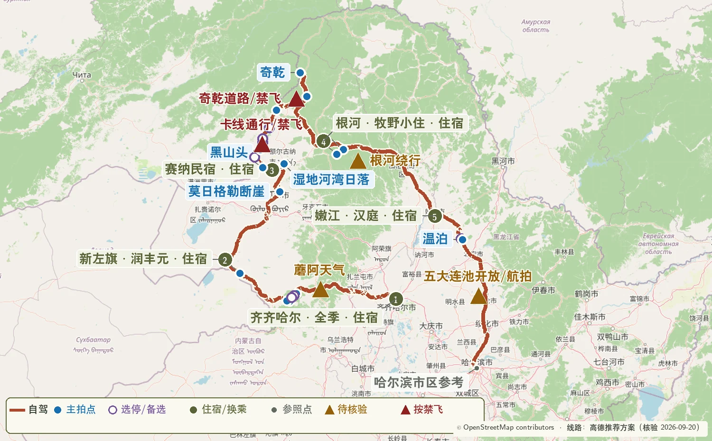

更新日期：**2026-09-04（北京时间）**

本页汇总 2026-09-26 至 2026-10-03 两套路线共用的核验入口。出发前按 T-7 日、T-72 小时、当天早晨三个时间点更新动态信息。

{.route-map loading="lazy" decoding="async" fig-alt="蘑阿天气、卡线通行、奇乾施工、根河绕行和国庆车流检查点地图"}

[OpenStreetMap｜版权与署名](https://www.openstreetmap.org/copyright) — 路线地图的底图数据来源。

## 一、日期、车辆与边境证件

- [中国政府网｜2026 年部分节假日安排](https://www.gov.cn/zhengce/zhengceku/202511/content_7047091.htm) — 中秋节 9 月 25--27 日、国庆节 10 月 1--7 日；用于设置住宿和道路客流冗余。
- [2026 年重大节假日小客车通行费安排](https://www.beijing.gov.cn/ywdt/gzdt/202511/t20251107_4265508.html) — 10 月 1 日 00:00 至 10 月 7 日 24:00 的高速免费时段。
- [国家移民管理局｜电子边境管理区通行证办理指引](https://s.nia.gov.cn/mps/bszy/dzbjtxz/blzy/202604/t20260414_1001.html) — 通过“移民局 12367”APP/小程序办理；卡线具体点位在 T-72 小时通过 12367 确认。
- [市场监管总局｜道路交通安全法实施条例](https://www.samr.gov.cn/zljds/zcfg/art/2023/art_5c212e15369443b3b2bea4e17a1c565b.html) — 连续驾驶 4 小时前停车休息至少 20 分钟。
- [一嗨租车｜租车规则示例](https://www.1hai.cn/NewHelp/HelpContent?isLimitRules=False&menuId=24) — 用于逐项核对跨省、边境道路、轮胎底盘、救援与异地还车条款；最终以实际订单合同为准。

## 二、阿尔山、蘑阿公路与卡线

- [内蒙古日报｜2026 年阿尔山秋色较往年提前 7--10 天](https://www.nmgsb.com.cn/system/mengshi/2026/0Z253c12026.html) — 9 月 2 日发布，支撑 9 月 26--27 日优先安排阿尔山。
- [内蒙古自治区交通运输厅信息转载｜S308 蘑阿公路养护工程主体贯通](https://finance.sina.com.cn/roll/2026-08-06/doc-inimmayt2841841.shtml) — 核对蘑菇气--柴河--阿尔山主线方向、189.7 公里规模与 2026 年养护进展。
- [阿尔山市政府｜阿尔山国家森林公园游览与交通说明](https://www.aes.gov.cn/aes/2025-04/15/article_2025041515301061440.html) — 核对游客中心停车、园内观光车、乌苏浪子湖 06:00—08:00 晨雾窗口，以及驼峰岭、杜鹃湖、石塘林和不冻河的园内关系；实际开放时间以临行公告为准。
- [高德地图｜乌兰山景区游客中心](https://www.amap.com/place/B0H2B7KSB8) — 核对游客中心导航落点和咨询渠道。
- [抖音｜2026-08-15 七卡至黑山头路况实拍](https://www.douyin.com/video/7674057106925003347) — 当季实地路况线索；09.28 晚和 09.29 早再向恩和、黑山头住宿方核实。

### 蓝点拍摄位置核验

- [扎兰屯市政府｜柴河景区资源](https://www.zhalantun.gov.cn/News/show/1317861.html) — 月亮天池、同心天池、山水岩壁画与十大湾等蘑阿沿线自然资源；本路线按当天时间选择山水岩壁画和西段河谷。
- [高德地图｜山水岩壁画](https://www.amap.com/place/B01D60NC0B) — 地图蓝点坐标与导航名称。
- [高德地图｜不冻河观景台](https://www.amap.com/place/B0FFJEZTED) — 9 月 26 日日落蓝点坐标。
- [高德地图｜额尔古纳湿地](https://www.amap.com/place/B0FFFGOSGZ) — 9 月 28 日湿地观景台蓝点坐标。
- [高德地图｜额尔古纳河乌兰山景区](https://www.amap.com/place/B0H2B7KCNJ) — 乌兰山入口与太极湾俯瞰点的导航核验。
- [高德地图｜呼伦贝尔自然景观榜](https://www.amap.com/ranking/hulunbeier/scenic) — 莫日格勒河、额尔古纳湿地、黑山头日落观测点和乌兰山太极湾的地点交叉核验。
- [卡线沿途实拍与停车点梳理](https://www.yoojia.com/dongtai/6696208002) — 五卡、乌兰山、七卡至八卡 S 弯与沿线停车带的相对顺序。
- [携程游记｜卡线北段与临江](https://gs.ctrip.com/html5/you/travels/2036894/4143183.html) — 九卡、室韦、临江与边境河谷的顺序核验。

## 三、奇乾、根河与返程景区

- [额尔古纳市多段公路施工预公告](https://www.sohu.com/a/1007413529_121124419) — 核对室韦、临江、太平、莫尔道嘎、奇乾一线施工与绕行方向；进入临江前必须确认临江—太平直连道路可用，否则跳过临江。
- [根河市政府｜G332 库布春林场至根河段通车公告](https://www.genhe.gov.cn/OpennessContent/show/530948.html) — 核对莫尔道嘎至根河方向道路衔接。
- [根河市政府｜G605 根河二桥维修及绕行公告](https://www.genhe.gov.cn/News/show/1441566.html) — 核对根河市区南下的绕行安排。
- [根河市政府｜敖鲁古雅使鹿部落景区 2026 年开园信息](https://www.genhe.gov.cn/News/show/1427854.html) — 确认本年度已经开园；10 月 1 日具体开放与最晚入园时间仍在 T-72 小时向景区确认。
- [五大连池风景区管委会](https://wdlcgwh.heihe.gov.cn/) — 核对老黑山、温泊开放区域、接驳、停车和国庆运行安排。
- [五大连池风景区管委会｜2026 年开放准备](https://wdlcgwh.heihe.gov.cn/wdlcfjq/xwtt/202604/c11_352438.shtml) — 温泊已进行水上设施与安全检修；本路线只给温泊保留约两小时，等待时间较长时直接转场。
- [高德地图｜黑龙山景区](https://www.amap.com/place/B01C8000E4) — 老黑山景区蓝点坐标；页面当前标注暂停开放，出发前以景区管委会公告为准。
- [高德地图｜温泊景区](https://www.amap.com/place/B01C800I2M) — 温泊蓝点坐标与导航入口。

## 四、施工、天气与森林安全

- [内蒙古自治区交通运输厅｜公路出行信息](https://jtyst.nmg.gov.cn/) — 临行核对呼伦贝尔、额尔古纳与大兴安岭林区道路公告。
- [黑龙江省交通运输厅｜公路路况信息](https://jt.hlj.gov.cn/jt/c105225/list.shtml) — 10 月 1--3 日每天出发前核对施工、事故与临时管制。
- [黑龙江省政府｜2026 年秋季森林草原防火部署](https://www.hlj.gov.cn/hlj/c116015shm/202604/c00_31932900.shtml) — 黑龙江秋季森林草原防火期为 9 月 15 日至 11 月 15 日。
- [国家林业和草原局｜内蒙古大兴安岭 2026 年森林防火部署](https://www.forestry.gov.cn/lyj/1/dfdt/20260317/663339.html) — 内蒙古大兴安岭森林防火期为 4 月 1 日至 10 月 31 日。
- [中国气象局｜中长期天气预报的使用方式](https://www.cma.gov.cn/2011xwzx/2011xqxxw/2011xqxyw/202407/t20240703_6395308.html) — 采用 T-7 日看趋势、T-72 小时排程、当天早晨执行的更新方式。
- [NOAA｜太阳时刻计算器](https://gml.noaa.gov/grad/solcalc/) — 临行复算卡线与林区日落时间，山谷道路按更早光照收尾。

## 五、摄影器材与无人机

- [DJI｜Air 3S 官方规格](https://www.dji.com/cn/mobile/air-3s/specs) — 起飞重量 724 克；24 mm 等效主摄、70 mm 等效中长焦；工作温度与抗风参数以官方页面为准。
- [佳能｜EOS R5 Mark II 官方规格](https://www.canon.com.cn/product/r5ii/spec.html) — 核对约 4500 万像素、双卡槽、机身防抖、RAW 与视频记录能力；官方标注工作温度为 0--40 ℃。
- [佳能｜RF28-70mm F2.8 IS STM](https://www.canon.com.cn/product/rf2870f28/index.html) — 日常挂机、道路与远山层次的主要镜头。
- [佳能｜RF16-28mm F2.8 IS STM](https://www.canon.com.cn/product/rf1628f28/spec.html) — 天池、熔岩、巨石和带近景的河谷画面；滤镜口径 67 mm。
- [中国民航局｜民用无人驾驶航空器监管服务公告](https://www.caac.gov.cn/XXGK/XXGK/TZTG/202312/t20231231_222550.html) — 无人机实名登记、UOM 平台、适飞空域查询与飞行活动申请入口。
- [中国政府网｜无人驾驶航空器飞行管理暂行条例](https://www.gov.cn/zhengce/content/202306/content_6888799.htm) — 无人机飞行的国家层面规则与法律责任。

## 更新节奏

1. T-7 日：天气趋势、酒店变更期限、租车订单与驾驶员证件。
2. T-72 小时：阿尔山园区接驳、莫日格勒河车辆取回、卡线、临江—太平直连道路、奇乾、敖鲁古雅、根河和五大连池逐项确认。
3. 每天早晨：气象预警、交通事件、森林火险、最晚到达时间与住宿点。
